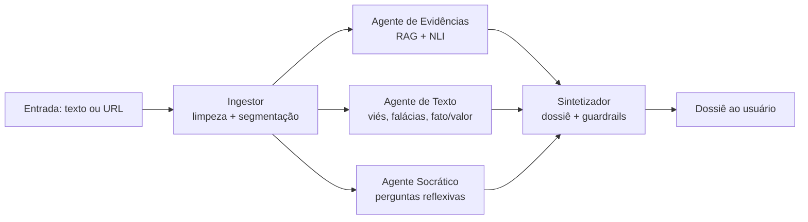
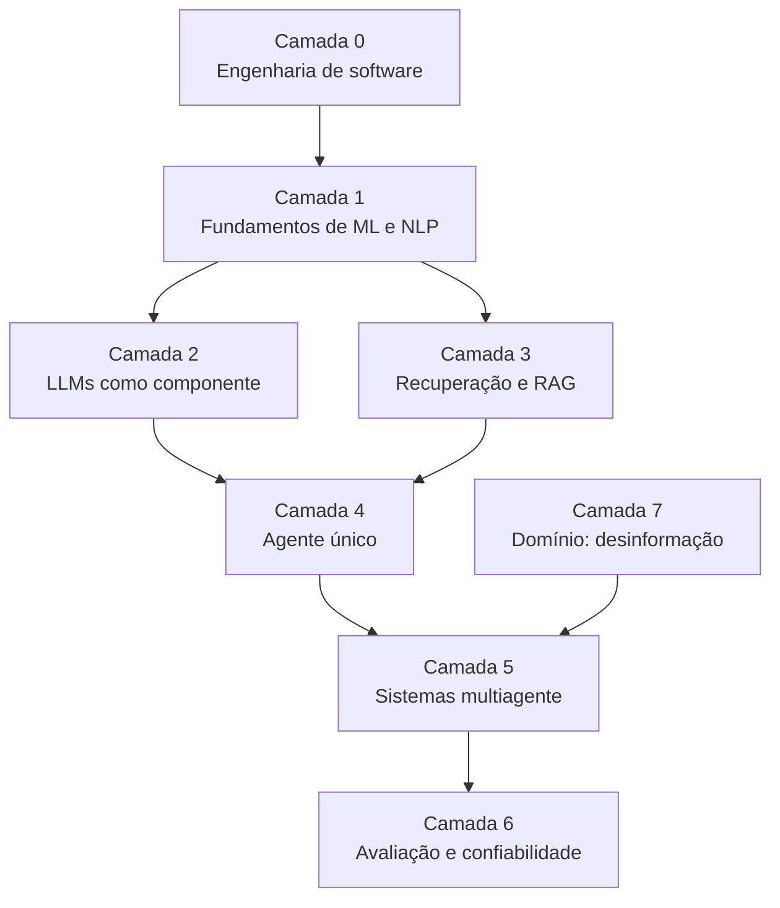

# Manual do Sistema Multiagente — Avaliação de Confiabilidade da Informação

Sep 21, 2026 · @felipe

## 1. Overview e princípios de design

O sistema recebe um texto ou URL suspeito e devolve um **dossiê de evidências** montado por agentes especializados — nunca um veredito de "falso" ou "verdadeiro". Ele responde à Essential Question do Desafio 1: como sistemas de IA podem ajudar pessoas a avaliar a confiabilidade de informações sem substituir seu pensamento crítico.

### 1.1 Princípios não negociáveis

Estes princípios funcionam como restrições de arquitetura. Toda decisão técnica deste manual é derivada deles.

| Princípio | Consequência arquitetural |
| --- | --- |
| Padrão andaime, não veredito | Nenhum nó produz rótulo binário; o Sintetizador aplica um filtro de veredito antes da entrega |
| Conteúdo e estrutura separados | Evidências avalia o conteúdo factual; Texto avalia a estrutura do argumento; o dossiê mostra os dois lado a lado, sem escore único |
| Fato separado de juízo de valor | O Agente de Texto classifica cada frase; o Sintetizador só apresenta stance de evidência para frases factuais |
| Explicabilidade local | Evidência só entra no dossiê com o link exato da checagem de origem |
| Incerteza honesta | Toda evidência tem estado `apoia` / `contradiz` / `insuficiente`; "insuficiente" é resposta válida |
| Imparcialidade auditável | Nenhum agente infere intenção política ou "beneficiários" de quem publica |

### 1.2 Fluxo em uma frase

O Ingestor limpa e segmenta o texto; três agentes trabalham sobre ele em paralelo — Evidências busca checagens anteriores, Texto analisa a estrutura do argumento e Socrático formula perguntas —; o Sintetizador junta os três resultados num dossiê e aplica os guardrails antes da entrega.

### 1.3 Escopo negativo (o que o sistema não faz)

- Não classifica notícias como fake ou real.
- Não atribui viés político a veículos ou autores.
- Não verifica opiniões nem juízos de valor.
- Não modera, remove ou ranqueia conteúdo.
- Não avalia a reputação da fonte nem os padrões de propagação nesta versão.
- Não analisa imagem ou vídeo; a entrada é texto ou URL de texto.

### 1.4 Entregável final (Semana 6)

Um protótipo funcional com interface web, rodando localmente nos MacBooks do grupo, avaliado contra um conjunto de teste curado, e acompanhado de um relatório de avaliação que compara a versão multiagente com uma versão de chamada única (baseline).

## 2. Evolução da arquitetura

A arquitetura passou por três versões. A primeira tinha cinco agentes (Coordenador, Evidências, Fontes, Texto, Socrático). A segunda, desenhada na primeira versão deste manual, cresceu para dez nós, incluindo decomposição de alegações, agente de fonte e verificador de grounding. A versão atual, **enxuta**, volta a cinco nós com fluxo fixo:

`Ingestor` → `[Evidências | Texto | Socrático]` em paralelo → `Sintetizador`

O ganho é de prazo e simplicidade: cerca de 3 chamadas de LLM por entrada em vez de 6 a 9, menos contratos entre integrantes e integração mais rápida. Tecnicamente, o sistema passa a ser um **workflow com agentes especializados** (topologia fixa), e não agentes autônomos que decidem quais ferramentas chamar. Para o prazo do projeto, essa é uma escolha defensável.

### 2.1 O que saiu, e o que compensa

| Componente da versão anterior | O que fazia | Como a versão enxuta compensa | Risco residual |
| --- | --- | --- | --- |
| Claim Extractor & Triage | Quebrava o texto em alegações atômicas e separava fato, opinião e valor | O Ingestor segmenta em frases; o Agente de Texto classifica cada frase em fato ou valor; o Sintetizador cruza os dois pelo `segment_id` | Frases longas ou compostas chegam inteiras ao NLI, que funciona melhor com afirmações curtas |
| Agente de Fonte | Reportava sinais verificáveis sobre quem publicou | Fora do escopo desta versão | O dossiê não diz nada sobre a fonte da notícia |
| Agente de Propagação | Opcional | Fora do escopo | — |
| Agregador | Juntava e deduplicava evidências | Absorvido pelo Sintetizador, com deduplicação determinística antes da chamada ao LLM | — |
| Grounding Verifier | Conferia se cada citação tinha lastro e tratava da mesma alegação | Citação obrigatória no Agente de Evidências + checagem determinística de URLs no Sintetizador | Nada confere se a checagem citada trata do mesmo fato ou de um fato parecido |
| Socrático sequencial, após o dossiê | Perguntava sobre lacunas do dossiê | Roda em paralelo e pergunta sobre lacunas da própria notícia | Pode perguntar algo que o dossiê já responde |

Os riscos residuais estão registrados na Seção 12 e são o foco da análise de erros do grupo.

## 3. Arquitetura do sistema

O sistema é um **grafo de estados em LangGraph** com topologia fixa: uma etapa de entrada, três ramos paralelos no mesmo *superstep* e uma etapa de síntese que só começa quando os três terminam.

### 3.1 Grafo de execução



### 3.2 Tipos de nó

| Nó | Tipo | Usa LLM gerador? | Paralelo? |
| --- | --- | --- | --- |
| Ingestor | Função determinística | Não | Não |
| Agente de Evidências | RAG com modelos encoder (embeddings + NLI) | Não | Sim |
| Agente de Texto | LLM local com few-shot e saída estruturada | Sim | Sim |
| Agente Socrático | LLM local com system prompt restrito | Sim | Sim |
| Sintetizador | LLM de alta capacidade + guardrails determinísticos | Sim | Não |

O Agente de Evidências não usa LLM gerador: busca vetorial e classificação NLI rodam com modelos encoder pequenos, mais rápidos e mais previsíveis.

### 3.3 Estado compartilhado (State)

O State é o **contrato entre integrantes**. A peça central é o `segment_id`: o Ingestor divide o texto em frases numeradas, e Evidências e Texto referenciam as mesmas frases. É isso que permite ao Sintetizador cruzar "esta frase é factual" (Texto) com "esta frase tem checagem que a contradiz" (Evidências).

```python
class Segment(BaseModel):
    id: str                        # ex.: "s03"
    text: str                      # uma frase da notícia

class Evidence(BaseModel):
    segment_id: str
    stance: Literal["apoia", "contradiz", "insuficiente"]
    excerpt: str                   # trecho literal da checagem
    source_url: str                # obrigatório
    source_name: str               # ex.: Aos Fatos, Lupa
    agency_verdict: str | None     # veredito da agência, citado com atribuição

class Statement(BaseModel):
    segment_id: str
    kind: Literal["factual", "valor"]

class TextMarker(BaseModel):
    type: Literal["adjetivacao_extrema", "urgencia_artificial",
                  "apelo_autoridade", "falsa_dicotomia", "generalizacao"]
    segment_id: str
    excerpt: str
    explanation: str

class TextReport(BaseModel):
    statements: list[Statement]
    markers: list[TextMarker]

class PipelineState(BaseModel):
    raw_input: str
    clean_text: str
    title: str | None
    published_at: str | None
    truncated: bool
    segments: list[Segment]
    evidence: list[Evidence] | None
    text_report: TextReport | None
    socratic_questions: list[str] | None
    dossier: str | None
    warnings: Annotated[list[str], operator.add]
```

Cada ramo paralelo escreve em um campo próprio, então não há conflito de escrita. A exceção é `warnings`, onde qualquer nó pode registrar uma falha; por isso ele usa um *reducer* (`operator.add`).

### 3.4 Fluxo de controle e tratamento de falhas

- **Fan-out estático:** três arestas saem do Ingestor. O LangGraph executa os três ramos no mesmo superstep e só chama o Sintetizador quando todos terminam.
- **Limite de entrada:** o Ingestor trunca textos acima de um limite fixo de tokens e marca `truncated = True`, que o dossiê informa ao usuário.
- **Timeout por nó:** um ramo que estoura o tempo grava um aviso em `warnings` e devolve `None`; os outros seguem.
- **Degradação graciosa:** o Sintetizador trata `None` como ausência declarada ("não foi possível analisar a estrutura do texto"), nunca como silêncio.

### 3.5 Guardrails

| Guardrail | Onde | Como |
| --- | --- | --- |
| Sem veredito | Sintetizador | Filtro determinístico sobre o texto final contra uma lista de termos ("falso", "verdadeiro", "fake news" e variações); se disparar, regenera uma vez com instrução reforçada |
| Sem citação inventada | Evidências + Sintetizador | Evidências só emite evidência com URL; o Sintetizador confere, sem LLM, que toda URL do texto final está na lista de evidências recebidas |
| Opinião não é checada | Sintetizador | Stance de evidência só aparece para frases que o Agente de Texto marcou como `factual` |
| Sem juízo político | Prompts de Texto e Sintetizador | Instrução explícita de não atribuir intenção, lado político ou "beneficiários" |
| Injeção de prompt via conteúdo | Ingestor | Texto da notícia sempre delimitado como dado, nunca como instrução |

O filtro por lista de termos tem uma limitação conhecida: paráfrases como "não procede" ou "é enganoso" passam por ele. O gold set inclui casos assim para medir quanto escapa (Seção 7).

## 4. Especificação de cada agente

Cada agente é um módulo Python isolado, testável sem o grafo, que recebe uma fatia do State e devolve um objeto Pydantic validado. Saída que não valida contra o schema é reprocessada uma vez; na segunda falha, o nó grava um aviso em `warnings` e devolve `None`.

### 4.1 Agente Ingestor

- **Técnica:** scraping determinístico, sem IA. `trafilatura` como extrator principal, `BeautifulSoup` como fallback.
- **Entrada:** texto livre ou URL.
- **Saída:** `clean_text`, `title`, `published_at`, `truncated` e `segments`.
- **Features:**
  - Limpeza automática de ruído do HTML: menus, anúncios, pop-ups.
  - Extração de texto limpo, título e data de publicação.
  - Truncamento de segurança para textos excessivamente longos.
  - Segmentação em frases numeradas (`s01`, `s02`…), com um segmentador de sentenças para português. É o que permite aos ramos paralelos falarem das mesmas frases.
- **Falhas conhecidas:** paywall, páginas renderizadas por JavaScript, data ausente no HTML.

### 4.2 Agente de Evidências

- **Técnica:** RAG vetorial sobre um ChromaDB local de checagens anteriores, combinado com um modelo de NLI multilíngue (`mDeBERTa-v3` treinado em XNLI) para classificar a stance.
- **Entrada:** `segments`.
- **Saída:** `list[Evidence]`.
- **Features:**
  - **Fact-checking vetorial:** para cada frase, busca os trechos mais próximos no banco de checagens.
  - **Classificação de stance:** o NLI recebe o trecho da checagem como premissa e a frase da notícia como hipótese. Entailment vira `apoia`, contradiction vira `contradiz`, neutral ou similaridade abaixo do limiar vira `insuficiente`.
  - **Citação obrigatória:** uma evidência só é emitida se tiver o link exato da checagem de origem.
- **Modelos:** embeddings multilíngues (ex.: BGE-M3 ou multilingual-e5) e mDeBERTa-v3 XNLI.
- **Falhas conhecidas:**
  - Checagem sobre um fato parecido, mas diferente (mesmo tema, número ou data distintos). É o erro mais perigoso do sistema, e nesta versão não há verificador dedicado.
  - Frases longas ou compostas reduzem a precisão do NLI.
  - Corpus desatualizado para fatos muito recentes, o que gera muitas respostas `insuficiente`.

### 4.3 Agente de Texto (análise sintática e semântica)

- **Técnica:** LLM local de 7–9B com few-shot prompting e saída estruturada em JSON.
- **Entrada:** `segments`.
- **Saída:** `TextReport`.
- **Features:**
  - **Scanner de viés e emoção:** detecta adjetivação extrema e tom de urgência artificial.
  - **Detector de falácias:** mapeia apelo à autoridade, falsa dicotomia e generalização indevida, sempre com o trecho exato e uma explicação curta.
  - **Separação estrutural:** classifica cada frase como afirmação factual ou juízo de valor.
- **Modelo:** candidatos da família Llama 3.x 8B ou Qwen \~8B; a versão final sai do mini-benchmark da Seção 5.3.
- **Falhas conhecidas:** ironia e sátira; confundir estilo editorial legítimo com manipulação; JSON inválido em modelos pequenos. Marcadores são apresentados como "padrões para observar", nunca como acusação.

### 4.4 Agente Socrático

- **Técnica:** LLM local guiado por system prompt restrito, focado em maiêutica.
- **Entrada:** `clean_text`.
- **Saída:** `socratic_questions`, com 2 a 3 perguntas.
- **Features:**
  - **Perguntas reflexivas:** formuladas sobre lacunas lógicas da notícia (ex.: "O autor apresenta dados para sustentar a afirmação X?").
  - **Gatilho de pensamento crítico:** questiona a estrutura do argumento, preparando o usuário para ler a síntese com ceticismo.
- **Regra:** a pergunta não pode embutir a resposta ("você não acha suspeito que…").
- **Modelo:** pode ser o mesmo modelo do Agente de Texto, em outra máquina para garantir paralelismo real (Seção 5.2).
- **Limitação:** como roda em paralelo, não vê as evidências; pode perguntar algo que o dossiê responde. O Sintetizador pode reordenar as perguntas, mas não as reescreve.

### 4.5 Agente Sintetizador

- **Técnica:** o LLM de maior capacidade do sistema. Duas opções: API paga de baixo custo, ou o maior modelo local que cabe no hardware (14B; ver Seção 5.1).
- **Entrada:** `evidence`, `text_report`, `socratic_questions`, `segments`.
- **Saída:** `dossier`.
- **Features:**
  - **Compilação do dossiê:** junta fatos (Evidências), estrutura (Texto) e reflexão (Socrático) em um relatório único, organizado por seção.
  - **Cruzamento fato/valor:** antes da chamada ao LLM, uma etapa determinística deduplica evidências por URL e descarta stance de frases que o Agente de Texto marcou como `valor`.
  - **Filtro de veredito (guardrail):** trava que impede o texto final de usar termos como "falso", "verdadeiro" ou "fake news" (Seção 3.5).
  - **Checagem de citações:** toda URL no texto final precisa estar entre as evidências recebidas.
  - **Formatação de andaime:** apresenta os dados de forma neutra, com linguagem de evidência ("duas checagens contradizem esta frase"), para que o usuário tome a decisão final.
- **Sobre o Qwen 32B:** não cabe com folga em um MacBook Air M4 de 24GB. Um 32B quantizado ocupa \~19GB só em pesos, acima do que a GPU enxerga por padrão, e gera 4–6 tokens/s. Use API ou 14B local.

## 5. Infraestrutura e stack

A inferência roda localmente, distribuída entre os 5 MacBook Air M4 de 24GB, com uma única chamada de API paga opcional no Sintetizador. Cada máquina serve um papel fixo na demo integrada, o que evita que vários modelos disputem a mesma memória unificada.

### 5.1 O que cabe em um M4 base de 24GB

Por padrão, a GPU enxerga cerca de 16–18GB dos 24GB; o planejamento seguro é \~18GB para pesos + KV cache ([pickuma, 2026](https://dev.to/pickuma/running-local-llms-on-m4-mac-with-24gb-ram-what-actually-fits-7jf)). A banda de memória do M4 base (\~120 GB/s) é o gargalo de velocidade, não o número de núcleos.

| Tamanho (Q4\_K\_M) | Pesos | Velocidade medida | Uso neste projeto |
| --- | --- | --- | --- |
| 7–8B | \~4,5–4,9 GB | 24–30 tok/s | Agentes de Texto e Socrático |
| 14B | \~9 GB | 12–14 tok/s | Fallback local do Sintetizador |
| 22B | \~13 GB | 7–9 tok/s | Evitar: lento demais para uma cadeia de chamadas |
| 32B | \~19 GB | 4–6 tok/s | Não usar |

Fonte das medições: [pickuma, 2026](https://dev.to/pickuma/running-local-llms-on-m4-mac-with-24gb-ram-what-actually-fits-7jf). Um prompt de 4.000 tokens num 14B leva \~12 s só para ser processado, então contexto longo custa caro: o RAG deve enviar só os trechos reranqueados, nunca documentos inteiros.

**Estimativa de latência do pipeline:** 3 chamadas de LLM por entrada — Texto e Socrático em paralelo, depois o Sintetizador. Com modelos de 7–9B nos ramos paralelos, a investigação deve levar de \~30 segundos (Sintetizador via API) a \~2 minutos (tudo local, Sintetizador 14B). A meta do MVP continua abaixo de 3 minutos, agora com folga.

### 5.2 Topologia de serving (demo integrada)

| Máquina | Papel | Serviços |
| --- | --- | --- |
| Mac 1 | Orquestração | Aplicação LangGraph, Ingestor, interface Streamlit, ChromaDB, tracing |
| Mac 2 | Agente de Texto | Ollama com modelo 7–9B |
| Mac 3 | Agente de Evidências | FastAPI com embeddings e NLI via PyTorch/MPS |
| Mac 4 | Agente Socrático | Ollama com modelo 7–9B (pode ser o mesmo do Mac 2) |
| Mac 5 | Sintetizador e avaliação | Ollama com 14B como fallback local da API; execução do gold set e do baseline |

Durante o desenvolvimento, cada integrante roda tudo localmente com modelos pequenos. A topologia distribuída é montada no Sprint 3, para integração e demo. Os serviços expõem endpoints na rede local (Ollama com `OLLAMA_HOST=0.0.0.0`). **Risco:** redes universitárias frequentemente bloqueiam tráfego entre máquinas; teste isso no Sprint 1 e tenha um plano B (roteador próprio, hotspot ou VPN mesh como Tailscale).

### 5.3 Escolha de modelos

A escolha final é feita no Sprint 1 por um mini-benchmark com 20 exemplos do gold set, não por reputação. Critérios, em ordem: validade do JSON estruturado, qualidade em português, velocidade no M4.

| Papel | Tamanho-alvo | Requisito principal | Candidatos a testar |
| --- | --- | --- | --- |
| Agente de Texto | 7–9B | JSON confiável, português | Família Llama 3.x 8B; Qwen \~8B |
| Agente Socrático | 7–9B | Seguir restrições do system prompt | Mesmo modelo do Agente de Texto |
| Sintetizador | API ou 14B local | Qualidade de escrita e fidelidade às citações | API paga de baixo custo; fallback local 14B |
| Embeddings | <1B | Multilíngue, bom em português | BGE-M3; multilingual-e5-large |
| NLI (stance) | <1B | XNLI com português | mDeBERTa-v3 XNLI multilíngue |

Os nomes da tabela são candidatos, não decisões. Verifique a versão mais recente disponível no Ollama e no Hugging Face na semana do benchmark.

### 5.4 Stack

| Camada | Ferramenta | Por quê |
| --- | --- | --- |
| Orquestração | LangGraph | Grafo de estados explícito, ramos paralelos no mesmo superstep, fácil de instrumentar |
| Contratos | Pydantic | Schemas do State e saídas estruturadas validadas |
| Serving de LLM | Ollama (API compatível com OpenAI); `mlx-lm` se precisar de mais velocidade | Setup em minutos; `mlx-lm` é mais rápido no Apple Silicon |
| Modelos auxiliares | sentence-transformers + FastAPI, backend MPS | Embeddings e NLI rodam na GPU do Mac |
| Banco vetorial | ChromaDB | Embutido, sem servidor, suficiente para alguns milhares de checagens |
| Extração de HTML | trafilatura, BeautifulSoup como fallback | Conteúdo principal de páginas de notícia |
| Segmentação | Segmentador de sentenças para português (ex.: spaCy) | Frases numeradas compartilhadas entre os ramos |
| Observabilidade | Arize Phoenix (local) ou LangSmith (cota gratuita) | Trace por nó: entrada, saída, latência, tokens |
| Interface | Streamlit | Protótipo rápido com streaming de progresso |
| Testes | pytest | Testes unitários por agente com fixtures fixas |

### 5.5 Estrutura do repositório

```text
projeto/
├── src/
│   ├── state.py              # schemas Pydantic (contrato do grupo)
│   ├── graph.py              # montagem do grafo LangGraph
│   ├── agents/
│   │   ├── ingestor.py
│   │   ├── evidence.py
│   │   ├── text_analysis.py
│   │   ├── socratic.py
│   │   └── synthesizer.py
│   ├── guardrails/           # filtro de veredito e checagem de citações
│   ├── retrieval/            # índice ChromaDB e busca vetorial
│   ├── services/             # clientes para Ollama e FastAPI auxiliar
│   └── prompts/              # prompts versionados em arquivo, nunca inline
├── data/
│   ├── corpus/               # checagens coletadas (não versionar dados brutos grandes)
│   └── gold/                 # gold set de avaliação
├── eval/                     # scripts de avaliação e relatórios
├── app/                      # interface Streamlit
├── tests/
└── docs/
```

Regra do repositório: prompts ficam em arquivos versionados. Mudança de prompt é mudança de comportamento e passa por Pull Request como qualquer código.

## 6. Dados

O sistema precisa de dois conjuntos de dados diferentes: um **corpus de conhecimento** (checagens já publicadas, que o RAG consulta) e um **gold set de avaliação** (entradas com resposta esperada, que medem o sistema). Os dois nunca se misturam sem controle, senão a avaliação mede memorização e não investigação.

### 6.1 Corpus de checagens (base do RAG)

| Fonte | Como coletar | Observação |
| --- | --- | --- |
| Google Fact Check Tools API | Endpoint `claims:search` com `languageCode=pt` e `reviewPublisherSiteFilter` por agência | O filtro por site dispensa `query`, então dá para listar tudo de uma agência ([documentação](https://developers.google.com/fact-check/tools/api/reference/rest/v1alpha1/claims/search)) |
| Aos Fatos, Agência Lupa, Comprova | Seguir o link de cada resultado da API e extrair o texto completo com trafilatura | A API devolve alegação, veredito e URL; o texto integral da checagem é o que vai para o índice |
| FACTCK.BR | Dataset público de checagens brasileiras ([repositório](https://github.com/tfs4/FACTCK.BR)) | Útil para volume inicial; verificar data de corte e licença antes de indexar |

**Pipeline de ingestão:** coleta → deduplicação por URL → extração de texto → chunking por parágrafo com sobreposição → embeddings → índice vetorial no ChromaDB. Cada chunk guarda metadados: agência, URL, data da checagem e o veredito original da agência.

O veredito original da agência é guardado, mas **não é repassado como conclusão ao usuário**. Ele serve para o Agente de Evidências apresentar o que a agência concluiu, com atribuição ("a Agência Lupa classificou como…"), nunca como veredito do próprio sistema.

**Meta de volume para o MVP:** alguns milhares de checagens em português, priorizando os últimos 24 meses. Volume maior não compensa se a qualidade do chunking e dos metadados for ruim.

### 6.2 Gold set de avaliação

Conjunto curado à mão pelo grupo, com 60 entradas no MVP, divididas em quatro tipos para testar comportamentos diferentes:

| Tipo | Qtd. | O que testa | Resposta esperada |
| --- | --- | --- | --- |
| Frase com checagem no corpus | 25 | Recuperação e stance | Encontrar a checagem correta, com stance correta |
| Frase sem checagem no corpus | 15 | Honestidade do sistema | `insuficiente`, sem inventar evidência |
| Opinião ou juízo de valor | 10 | Separação fato/valor | Agente de Texto marca como `valor`; o dossiê não mostra stance para ela |
| Texto misto (fato + valor + retórica) | 10 | Pipeline completo e guardrail | Separação fato/valor correta, marcadores pertinentes e nenhuma linguagem de veredito, inclusive paráfrases |

Cada entrada registra: texto de entrada, frases com rótulo fato/valor, stance e URL de evidência esperadas, e marcadores de retórica esperados. Duas pessoas anotam cada entrada; divergências são resolvidas em reunião.

**Cuidado com vazamento:** as alegações do tipo "com checagem no corpus" devem ser **parafraseadas**, nunca copiadas do título da checagem. Se forem copiadas, a busca lexical as encontra trivialmente e a métrica fica inflada.

**Divisão para o stretch goal:** se a calibração conformal (Seção 11) for implementada, 20 das 60 entradas ficam reservadas como conjunto de calibração e não são usadas para ajustar prompts.

## 7. Avaliação e métricas

O sistema é avaliado **por componente** e **ponta a ponta**, sempre contra o gold set. Avaliar só o dossiê final esconde onde está o erro; avaliar só componentes esconde falhas de integração.

### 7.1 Métricas por componente

| Componente | Métrica | Como medir | Meta inicial do MVP |
| --- | --- | --- | --- |
| Agente de Texto | Macro-F1 fato / valor | Comparação com o rótulo do gold set, por frase | ≥ 0,75 |
| Agente de Texto | Marcadores pertinentes | Rubrica humana: o marcador aponta um padrão real no trecho? | ≥ 0,70 |
| Evidências — recuperação | Recall@5 | A checagem esperada aparece entre os 5 primeiros resultados? | ≥ 0,70 |
| Evidências — stance | Macro-F1 apoia / contradiz / insuficiente | Comparação com a stance anotada | ≥ 0,65 |
| Evidências — abstenção | Taxa de evidência inventada | Nas 15 frases sem checagem, % em que houve evidência em vez de `insuficiente` | ≤ 0,10 |
| Sintetizador — citações | Validade de citação | % de URLs no dossiê que estão na lista de evidências | 1,00 (checagem determinística) |
| Sintetizador — veredito | Vazamento de veredito | % de dossiês com linguagem de veredito, incluindo paráfrases | 0 |
| Socrático | Qualidade das perguntas | Rubrica humana 1–3: aberta, ancorada na notícia, não indutiva | Média ≥ 2,5 |
| Sistema | Latência | p50 e p95 ponta a ponta, por entrada | p50 < 3 min |

As metas são pontos de partida para o grupo discutir, não números da literatura. O relatório final apresenta o valor atingido ao lado da meta, inclusive quando a meta não for batida.

### 7.2 LLM-as-judge: onde usar e como mitigar viés

Avaliar grounding e qualidade de síntese em 60 entradas à mão é inviável a cada mudança de prompt, então parte da avaliação usa um LLM como juiz. Isso tem um risco documentado: modelos avaliadores tendem a dar notas mais altas a textos gerados por eles mesmos, o chamado *self-preference bias* ([Panickssery, Bowman e Feng, NeurIPS 2024](https://arxiv.org/abs/2404.13076v1)).

Mitigações adotadas:

- O juiz é sempre de família diferente do modelo que gerou o texto avaliado.
- Quando possível, usar um painel de 2 ou 3 modelos pequenos e diferentes em vez de um único juiz, abordagem que reduz viés individual ([Verga et al., 2024](https://arxiv.org/pdf/2404.18796)).
- Toda rubrica do juiz é validada contra 15 casos anotados por humanos antes de ser usada em escala. Se a concordância juiz-humano for baixa, a métrica volta a ser manual.

### 7.3 Experimento de controle: multiagente vs. chamada única

O relatório final compara o sistema multiagente com um **baseline de chamada única**: o mesmo modelo, com o procedimento inteiro descrito em um único prompt e o mesmo acesso ao RAG. Esse experimento responde se a decomposição em agentes realmente compensa o custo em latência — uma pergunta em aberto na literatura, com trabalhos recentes mostrando que prompts in-context podem igualar orquestração em tarefas procedurais ([arXiv 2604.27891](https://arxiv.org/pdf/2604.27891)). Qualquer que seja o resultado, ele é um achado do projeto.

### 7.4 Teste com usuários (simplificado)

Na Semana 6 o grupo roda um teste com 6 a 10 colegas de fora do projeto: cada participante avalia 3 textos sem o sistema e 3 com o sistema, e depois responde se conseguiria justificar sua conclusão com evidência. O objetivo não é significância estatística, e sim observar se o sistema leva o usuário a raciocinar ou apenas a copiar a síntese.

## 8. Pré-requisitos de conhecimento

Construir um sistema multiagente exige saber construir um agente; construir um agente exige saber quais técnicas de IA existem e quando usar cada uma; e tudo isso se apoia em fundamentos de ML, NLP e engenharia. Esta seção organiza esse conhecimento em camadas, da base para o topo.

### 8.1 Árvore de dependências



Ninguém precisa dominar todas as camadas. Cada papel (Seção 9) tem uma trilha de estudo própria na Seção 8.4.

### 8.2 Tipos de IA e quando usar cada um

Um erro comum é usar LLM para tudo. Neste sistema, cada tarefa usa a técnica mais simples que resolve bem.

| Técnica | O que é | Quando usar | Onde aparece neste sistema |
| --- | --- | --- | --- |
| Regra determinística | Código sem aprendizado (regex, lookup, parsing) | Tarefa com resposta exata e verificável | Ingestor, segmentação, filtro de veredito, checagem de citações |
| ML clássico | Modelos estatísticos treinados (regressão logística, SVM, árvores) sobre features | Classificação com dados rotulados e features claras | Não usado nesta versão |
| Encoder transformer | Modelos tipo BERT que produzem representações do texto | Similaridade, classificação, NLI | Embeddings e NLI do Agente de Evidências |
| LLM generativo | Modelo decoder que gera texto a partir de instruções | Tarefas abertas de linguagem, extração estruturada, síntese | Agentes de Texto, Socrático e Sintetizador |
| RAG | Recuperação de documentos externos antes de gerar ou classificar | Respostas que precisam de fatos atualizados e citáveis | Agente de Evidências |
| Agente autônomo | LLM em laço, decidindo quais ferramentas chamar | Tarefas com passos que dependem de resultados intermediários | Não usado nesta versão: cada nó é uma etapa fixa do workflow |
| Sistema multiagente | Vários agentes especializados coordenados | Tarefa decomponível em subtarefas independentes | O sistema como um todo |

### 8.3 Tópicos por camada

**Camada 0 — Engenharia de software**

- Python assíncrono (`asyncio`), APIs REST e clientes HTTP
- Pydantic e JSON Schema: validação de dados e contratos entre módulos
- Git com branches e Pull Requests, testes com pytest
- Serviços em rede local: portas, host, latência

**Camada 1 — Fundamentos de ML e NLP**

- Tokenização e janela de contexto
- Embeddings e espaço vetorial; similaridade de cosseno
- Arquitetura transformer: encoder (BERT) vs. decoder (GPT, Llama, Qwen)
- Classificação supervisionada e métricas: precisão, recall, F1, macro-F1, matriz de confusão
- Natural Language Inference (NLI): entailment, contradiction, neutral
- Fine-tuning vs. in-context learning
- Quantização (Q4, Q8) e seu efeito em memória e qualidade

**Camada 2 — LLMs como componente**

- Prompting: system prompt, zero-shot, few-shot, chain-of-thought
- Structured output e constrained decoding (JSON mode, gramáticas)
- Parâmetros de amostragem: temperatura, top-p; por que usar temperatura baixa em extração
- Alucinação: causas e mitigação por grounding
- Prompt injection: conteúdo externo tratado como dado, nunca como instrução
- Serving local: Ollama, llama.cpp, MLX; API compatível com OpenAI

**Camada 3 — Recuperação e RAG**

- Chunking: tamanho, sobreposição, chunking por estrutura
- Busca densa (embeddings) vs. busca esparsa (BM25)
- Busca híbrida e reciprocal rank fusion (RRF)
- Reranking com cross-encoder vs. bi-encoder
- Bancos vetoriais e busca aproximada (HNSW)
- Métricas de recuperação: Recall@k, MRR

**Camada 4 — Agente único**

- Laço ReAct (raciocinar → agir → observar)
- Tool calling / function calling: definição de ferramentas por schema
- Memória de curto prazo (estado) vs. longo prazo (índice)
- Autocrítica e reflexão
- Guardrails de entrada e saída

**Camada 5 — Sistemas multiagente**

- Topologias de coordenação: centralizada, hierárquica, descentralizada
- Grafo de estados: nós, arestas, arestas condicionais, ciclos com limite
- Gerenciamento de estado e reducers para escrita concorrente
- Fan-out / fan-in dinâmico (padrão map-reduce, `Send` do LangGraph)
- Padrão generator-evaluator
- Tratamento de falhas: timeout, retry, degradação graciosa
- Observabilidade: tracing por nó, custo e latência

**Camada 6 — Avaliação e confiabilidade**

- Construção de gold set e anotação; concordância entre anotadores (kappa de Cohen)
- Avaliação por componente vs. ponta a ponta
- LLM-as-judge e seus vieses (self-preference, posição, tamanho)
- Calibração: o que significa um modelo estar calibrado; Expected Calibration Error
- Conformal prediction (stretch goal, Seção 11)

**Camada 7 — Domínio**

- Information disorder: desinformação, informação incorreta, má-informação
- Como agências de checagem trabalham; o schema ClaimReview
- Framing, falácias lógicas, linguagem emocional
- Os princípios de design da Seção 1: padrão andaime, explicabilidade, incerteza honesta e imparcialidade

### 8.4 Trilha de estudo por papel

P = precisa dominar; B = precisa do básico; vazio = opcional. Todos precisam das Camadas 0 e 7.

| Camada | R1 Ingestor + Orquestração | R2 Evidências | R3 Texto | R4 Socrático | R5 Sintetizador |
| --- | --- | --- | --- | --- | --- |
| 1. ML e NLP | B | P | P | B | B |
| 2. LLMs como componente | B | B | P | P | P |
| 3. Recuperação e RAG | B | P |  |  | B |
| 4. Agente único | B | B | B | P | B |
| 5. Multiagente | P | B | B | B | B |
| 6. Avaliação | B | P | P | B | P |

Na primeira semana, cada integrante estuda sua coluna P antes de escrever código de produção. O Sprint 1 reserva tempo explícito para isso.

## 9. Papéis e responsabilidades

Cada integrante é **dono de um agente, de ponta a ponta**: escolhe a técnica, implementa, testa, mede e documenta. Além do agente, cada um carrega uma responsabilidade transversal, e um deles orquestra o sistema inteiro. Assim todos passam por modelagem, engenharia e avaliação, em vez de cada um ficar preso a uma camada.

### 9.1 Visão geral

| Papel | Agente próprio | Responsabilidade transversal | Revisor cruzado |
| --- | --- | --- | --- |
| R1 | Ingestor | **Orquestração:** grafo, State, integração, topologia dos 5 Macs, tracing | R5 |
| R2 | Evidências | Corpus de checagens; conformal prediction (stretch) | R1 |
| R3 | Texto | Harness de avaliação comum; experimento de chamada única | R2 |
| R4 | Socrático | Interface Streamlit; teste com usuários | R3 |
| R5 | Sintetizador | Guardrails: filtro de veredito e checagem de citações | R4 |

O Ingestor é o único agente sem LLM e o de menor complexidade de modelagem. Por isso quem fica com ele assume a orquestração.

### 9.2 O que significa ser dono de um agente

Todo dono entrega, para o seu agente:

- [ ] Escolha da técnica e do modelo, justificada pelo mini-benchmark (Seção 5.3) quando houver LLM
- [ ] Implementação como módulo isolado, respeitando o contrato do State
- [ ] Stub funcional desde o primeiro dia, para o orquestrador nunca ficar bloqueado
- [ ] Testes unitários com fixtures fixas
- [ ] A métrica do próprio agente (Seção 7.1) reportada no harness comum
- [ ] Anotação de 12 das 60 entradas do gold set, revisadas pelo revisor cruzado
- [ ] Um card do agente em `docs/agents/`: entrada, saída, modelo, limitações conhecidas
- [ ] A apresentação do próprio agente no Showcase

**Revisor cruzado:** revisa os Pull Requests do agente, roda casos adversariais contra ele e conhece o código o suficiente para cobrir uma ausência. É o que mantém a regra "quem gera não verifica": os guardrails do Sintetizador (R5) são atacados por R4 antes de cada Sprint Review.

### 9.3 Objetivos por agente

**R1 — Ingestor e Orquestração**

- **Objetivo:** transformar qualquer URL ou texto em frases limpas e numeradas, e manter o grafo inteiro rodando desde o primeiro dia.
- **Entregáveis do agente:** extração com trafilatura; título, data e truncamento; segmentação em frases com `segment_id`.
- **Entregáveis de orquestração:** `state.py` e `graph.py`; stubs de todos os nós; integração de cada agente real assim que ficar pronto; topologia distribuída; tracing; latência medida.
- **Metas:** extração sem erro em todas as páginas do gold set; grafo executando ponta a ponta no fim de cada sprint; latência p50 < 3 min.
- **Estudar primeiro:** Camadas 0 e 5.

**R2 — Agente de Evidências**

- **Objetivo:** para cada frase, encontrar checagens anteriores relevantes e dizer se apoiam, contradizem ou são insuficientes, sempre com link.
- **Entregáveis:** coleta via Fact Check Tools API e FACTCK.BR; índice no ChromaDB; embeddings; classificação de stance com NLI; limiar de similaridade calibrado; conformal prediction se houver tempo.
- **Metas:** Recall@5 ≥ 0,70; macro-F1 de stance ≥ 0,65; evidência inventada ≤ 0,10.
- **Estudar primeiro:** Camadas 1 e 3.

**R3 — Agente de Texto**

- **Objetivo:** mostrar como o texto argumenta: quais frases são factuais e quais são juízo de valor, onde há emoção carregada e onde há falácia.
- **Entregáveis:** prompt few-shot e schema de saída; exemplos rotulados em português; harness comum de avaliação que todos usam; experimento de chamada única (Seção 7.3).
- **Metas:** macro-F1 fato/valor ≥ 0,75; marcadores pertinentes ≥ 0,70.
- **Estudar primeiro:** Camadas 1, 2 e 6.

**R4 — Agente Socrático**

- **Objetivo:** gerar 2 a 3 perguntas que façam o usuário examinar o argumento da notícia antes de ler a síntese.
- **Entregáveis:** system prompt de maiêutica com taxonomia de perguntas; interface Streamlit com progresso; protocolo e execução do teste com usuários; ataque adversarial aos guardrails do Sintetizador.
- **Metas:** rubrica de qualidade ≥ 2,5; nenhuma pergunta indutiva no gold set.
- **Estudar primeiro:** Camadas 2 e 4.

**R5 — Agente Sintetizador**

- **Objetivo:** juntar os três ramos num dossiê neutro e citável, sem veredito.
- **Entregáveis:** etapa determinística de cruzamento fato/valor e deduplicação; prompt do Sintetizador; filtro de veredito; checagem de citações; decisão entre API e 14B local.
- **Metas:** validade de citação 1,00; vazamento de veredito 0, inclusive em paráfrases.
- **Estudar primeiro:** Camadas 2 e 6.

### 9.4 Como a orquestração funciona na prática

Orquestrar não é juntar tudo no fim. R1 monta o esqueleto com stubs na Sprint 1, e cada dono troca o seu stub pelo agente real assim que ele passa nos testes. A regra de integração é simples: **um agente só entra no grafo principal por Pull Request aprovado pelo revisor cruzado e por R1**, com a saída validando no schema do State. Se um agente real quebrar o grafo, R1 volta o stub e o dono corrige fora do caminho principal.

### 9.5 Papéis de Scrum

| Papel | Quem | Responsabilidade |
| --- | --- | --- |
| Product Owner | Um integrante, fixo nas 4 sprints | Mantém o backlog alinhado à Essential Question e aos princípios da Seção 1; leva prioridades para decisão coletiva |
| Scrum Master | Rotativo, um integrante diferente por sprint | Conduz planning, review e retrospectiva; acompanha bloqueios; mantém o board atualizado |
| Developers | Todos os 5 | Executam o backlog da sprint dentro do seu papel técnico |

O escopo de cada sprint é decidido em conjunto, com opinião de todos, na Sprint Planning. Nenhum papel decide sozinho.

### 9.6 Contratos entre papéis

Os papéis trabalham em paralelo porque se comunicam por contratos, não por conversa. Três contratos são fechados no primeiro dia do Sprint 1:

1. **Schema do State** (`state.py`): quem escreve cada campo e em que formato. Dono: R1, aprovado por todos.
2. **Formato do gold set**: campos e exemplos. Dono: R3, aprovado por todos.
3. **Interface dos serviços de modelo**: endpoints de LLM, embeddings e NLI. Dono: R1.

Enquanto um módulo real não existe, quem depende dele usa um **stub** que devolve uma saída fixa e válida no schema. Assim ninguém fica bloqueado esperando outro papel.

## 10. Sprints

O projeto tem 4 sprints de 1 semana, alinhadas às semanas 3 a 6 do cronograma do desafio: fim do Investigate, as duas semanas de Act e o Showcase. A estratégia é construir primeiro um **esqueleto ponta a ponta com stubs** e depois substituir cada stub pela versão real, em vez de construir cada agente completo e integrar tudo no final.

| Sprint | Fase do CBL | Objetivo da sprint | Termina em |
| --- | --- | --- | --- |
| 1 | Investigate (Semana 3) | Contratos fechados e grafo rodando ponta a ponta com stubs | Sep 25, 2026 |
| 2 | Act (Semana 4) | Todos os agentes reais; primeira execução sem stubs | Oct 2, 2026 |
| 3 | Act (Semana 5) | Verificação, robustez, topologia distribuída e baseline | Oct 9, 2026 |
| 4 | Showcase (Semana 6) | Avaliação final, teste com usuários e apresentação | Oct 16, 2026 |

**Cerimônias:** Sprint Planning no primeiro dia de cada sprint; check-in assíncrono 2 a 3 vezes por semana (o que fiz, o que farei, bloqueios); Sprint Review e Retrospectiva no último dia.

### 10.1 Sprint 1 — Fundação

**Objetivo:** qualquer integrante consegue rodar o grafo inteiro na própria máquina, com stubs, e ver o trace de cada nó.

| Papel | Backlog |
| --- | --- |
| Todos | Rodar a dinâmica de levantamento de requisitos (story mapping) logo no início do dia 1, antes de fechar os contratos; estudar a própria trilha P (Seção 8.4); fechar os 3 contratos da Seção 9.6 à luz do que sair da dinâmica; cada um entrega o stub do próprio agente e anota 6 entradas do gold set |
| R1 | Repositório e estrutura de pastas; `state.py`; `graph.py` com os stubs de todos; Ingestor com limpeza e segmentação; Ollama instalado; teste de rede entre os Macs; tracing ativo |
| R2 | Coleta via Fact Check Tools API das 3 agências; extração de texto; primeiro índice no ChromaDB |
| R3 | Schema e prompt do Agente de Texto, primeira versão real no grafo; formato do gold set e esqueleto do harness; mini-benchmark de modelos (Seção 5.3) |
| R4 | Taxonomia de perguntas e primeira versão do system prompt socrático; wireframe e Streamlit exibindo a saída dos stubs |
| R5 | Formato do dossiê; primeira versão do prompt do Sintetizador; lista inicial de termos do filtro de veredito |

**Marco de integração:** o grafo roda ponta a ponta com stubs, e o Agente de Texto já é real.

### 10.2 Sprint 2 — Agentes reais

**Objetivo:** primeira execução ponta a ponta sem stubs, mesmo que lenta, e primeiro relatório de métricas.

| Papel | Backlog |
| --- | --- |
| Todos | Anotar mais 6 entradas do gold set cada (fecha as 60); revisão cruzada do agente atribuído |
| R1 | Ingestor robusto (paywall, JavaScript, truncamento); integrar cada agente real que passar nos testes; ramos paralelos, timeouts e `warnings` |
| R2 | NLI de stance; Agente de Evidências completo com citação obrigatória; medir Recall@5 e stance |
| R3 | Detector de falácias e separação fato/valor validados; harness automatizado rodando para todos os agentes |
| R4 | Agente Socrático real no grafo; interface mostrando cada ramo |
| R5 | Sintetizador com cruzamento fato/valor e citações; filtro de veredito e checagem de citações v1 |

**Marco de integração:** execução completa sem stubs em uma máquina; primeiro relatório de métricas da Seção 7.1.

### 10.3 Sprint 3 — Verificação e robustez

**Objetivo:** o sistema roda na topologia da demo, com guardrails completos, e o experimento de baseline está feito. Última sprint com features novas.

| Papel | Backlog |
| --- | --- |
| R1 | Topologia distribuída nos 5 Macs; degradação graciosa; latência p50/p95 |
| R2 | Ajustar chunking e limiar; ampliar o corpus; tratar o erro "fato parecido mas diferente"; iniciar conformal se a stance estiver estável |
| R3 | Ironia e sátira; robustez do JSON; experimento de chamada única (Seção 7.3); validar juiz contra humanos |
| R4 | Streaming de progresso; protocolo do teste com usuários; ataque adversarial aos guardrails do Sintetizador |
| R5 | Filtro de veredito contra paráfrases; decisão final entre API e 14B local; dossiê organizado por seção |

**Marco de integração:** *feature freeze* no último dia. A partir daqui, só correções.

### 10.4 Sprint 4 — Avaliação final e Showcase

**Objetivo:** números finais, teste com usuários e apresentação ensaiada.

| Papel | Backlog |
| --- | --- |
| Todos | Apenas correção de bugs; card do próprio agente finalizado; análise de erros do próprio agente; slides; relatório final; retrospectiva |
| R1 | Ensaio da demo na rede do local da apresentação; plano B com vídeo gravado da execução |
| R2 | Métricas finais de Evidências; conformal, se implementado |
| R3 | Avaliação final completa contra as metas, consolidando as métricas de todos; resultado do baseline |
| R4 | Teste com 6 a 10 colegas; ajustes finais de interface |
| R5 | Relatório de vazamento de veredito e validade de citação |

**Marco:** apresentação do Showcase. Se ela acontecer no meio da semana 6, as tarefas de R4 e R5 desta sprint começam no fim da Sprint 3.

### 10.5 Definition of Done

Um item só está pronto quando cumpre todos os critérios:

- [ ] Código integrado por Pull Request, revisado por pelo menos um integrante de outro papel
- [ ] Saída valida contra o schema do State
- [ ] Testes unitários do módulo passam com fixtures fixas
- [ ] Prompts versionados em `prompts/`, não inline
- [ ] Execução aparece no tracing com latência registrada
- [ ] Métrica do componente reportada no harness de avaliação, quando aplicável

### 10.6 Regra de corte de escopo

Se uma sprint atrasar, o corte segue esta ordem, do primeiro a sair para o último: conformal prediction → detector de falácias do Agente de Texto (mantém a separação fato/valor e o scanner de emoção) → topologia distribuída (a demo roda em uma máquina, com modelos menores) → Sintetizador via API (fica só o local). O núcleo que nunca é cortado: Ingestor, Agente de Evidências, separação fato/valor, Agente Socrático, Sintetizador com guardrails e interface.

## 11. Stretch goal: calibração por conformal prediction

Se houver tempo na Sprint 3, o classificador de stance ganha uma camada de **split conformal prediction**: em vez de devolver um único rótulo com uma "confiança" sem garantia, ele devolve um *conjunto* de rótulos que contém o rótulo correto com probabilidade garantida, por exemplo 90%. A garantia vale para qualquer modelo pré-treinado e não depende de suposições sobre a distribuição dos dados ([Angelopoulos e Bates, 2021](https://arxiv.org/abs/2107.07511v6)).

### 11.1 Por que isso encaixa no padrão andaime

O conjunto de previsão comunica incerteza de forma honesta e verificável. Quando o conjunto tem um único rótulo (`{contradiz}`), a evidência é clara. Quando tem dois ou três (`{apoia, insuficiente}`), o sistema mostra ao usuário que aquela evidência é **ambígua**, em vez de escolher um rótulo e parecer seguro. Isso é exatamente o princípio de incerteza honesta da Seção 1.1, agora com lastro matemático.

### 11.2 Procedimento

1. Separar o conjunto de calibração: pares (alegação, trecho) das 20 entradas reservadas do gold set, com stance anotada. Esses pares nunca são usados para ajustar prompts ou limiares.
2. Para cada par de calibração, calcular o *nonconformity score*: 1 menos a probabilidade que o modelo de NLI atribui ao rótulo verdadeiro.
3. Escolher o nível de erro α (por exemplo, 0,10) e calcular o quantil corrigido dos scores:

```latex
\hat{q} = \text{Quantile}\left(s_1, \dots, s_n;\ \frac{\lceil (n+1)(1-\alpha) \rceil}{n}\right)
```

4. Em produção, o conjunto de previsão de um novo par inclui todo rótulo cuja probabilidade é pelo menos 1 − q̂:

```latex
C(x) = \{\, y : \hat{p}(y \mid x) \ge 1 - \hat{q} \,\}
```

5. A garantia resultante é de **cobertura marginal**:

```latex
P\big(Y_{n+1} \in C(X_{n+1})\big) \ge 1 - \alpha
```

### 11.3 Limitações que o relatório precisa declarar

- **A garantia é marginal, não por exemplo.** Ela vale em média sobre muitas entradas, não para cada alegação individual.
- **Exige permutabilidade** (*exchangeability*): os dados de calibração e de uso precisam vir da mesma distribuição. Notícias de outro período ou outro tema quebram essa suposição.
- **Amostra pequena.** Com algumas dezenas de pares de calibração, a garantia vale, mas os conjuntos tendem a ser grandes; medir e reportar o tamanho médio do conjunto junto com a cobertura.
- **Não calibra o sistema inteiro.** Só a etapa de stance recebe a garantia; extração e recuperação continuam sem ela.

### 11.4 Critério para começar

Só iniciar se, no fim da Sprint 2, o harness de avaliação estiver funcionando e o macro-F1 de stance estiver medido. Conformal sobre um classificador ainda instável gera conjuntos enormes e pouco informativos.

## 12. Riscos, governança e limitações

O maior risco técnico da versão enxuta é o Agente de Evidências citar uma checagem sobre um fato parecido, mas diferente, sem um verificador dedicado para barrar isso. O maior risco de prazo continua sendo a integração ficar para o fim, mitigado pelo esqueleto com stubs desde a Sprint 1.

### 12.1 Riscos técnicos

| Risco | Impacto | Mitigação | Dono |
| --- | --- | --- | --- |
| Checagem sobre fato parecido, mas diferente | Dossiê cita checagem que não se aplica | Limiar de similaridade conservador; stance `insuficiente` na dúvida; casos no gold set; análise de erros a cada sprint | R2 |
| NLI sobre frases longas ou compostas | Stance errada | Segmentação fina no Ingestor; medir macro-F1 de stance por tamanho de frase | R1, R2 |
| Filtro de veredito não pega paráfrases | Veredito implícito no dossiê | Lista de termos ampliada; casos de paráfrase no gold set; ataque adversarial de R4 | R5 |
| Socrático pergunta algo que o dossiê já responde | Perguntas redundantes | Sintetizador reordena as perguntas; rubrica humana mede o problema | R4, R5 |
| Latência acima de 3 min | Demo inviável | Ramos paralelos em Macs diferentes; Sintetizador via API | R1 |
| Rede da residência bloqueia tráfego entre Macs | Topologia distribuída não funciona | Testar na Sprint 1; plano B com roteador próprio ou VPN mesh | R1 |
| JSON inválido de modelos pequenos | Falhas em cascata | Structured output com schema; 1 retry; `warnings` em vez de derrubar o grafo | R3, R4 |
| Agente real quebra o grafo principal | Integração travada | Entrada no grafo só por PR aprovado; volta ao stub em caso de falha | R1 |
| Prompt injection via conteúdo da notícia | Agente segue instruções do texto analisado | Conteúdo sempre delimitado como dado; nenhum agente executa ações externas | R1 |

### 12.2 Governança

- **Imparcialidade:** a rubrica do Agente de Texto e os prompts do Sintetizador são revisadas pelo grupo inteiro antes de entrar em uso.
- **Auditoria de viés:** o gold set inclui alegações de diferentes espectros políticos em proporção equilibrada; o relatório final compara as métricas por grupo.
- **Transparência:** o dossiê informa sempre de onde veio cada evidência (corpus ou web) e quando a busca falhou.
- **Dados:** o corpus usa apenas conteúdo público de agências de checagem, com atribuição; nenhum dado pessoal de usuários é armazenado.
- **Decisões de arquitetura:** mudanças no schema do State, na lista de modelos ou nos guardrails são registradas em um arquivo de decisões (ADR curto) no repositório.

### 12.3 Limitações declaradas

- O sistema só é tão bom quanto a cobertura das agências brasileiras de checagem; afirmações nunca checadas terão pouca evidência.
- Esta versão não avalia a fonte da notícia nem como ela se propaga; o dossiê cobre conteúdo e estrutura.
- Não há verificador dedicado: a conferência de citações é determinística e não detecta checagem sobre fato parecido.
- Modelos locais de 7–14B têm raciocínio inferior aos modelos de fronteira; isso é um trade-off consciente de custo e privacidade.
- O teste com usuários é pequeno e ilustrativo, não conclusivo.
- O sistema não analisa imagem, áudio nem vídeo, que são hoje uma parte relevante da desinformação.

## 13. Referências

**Orquestração e sistemas multiagente**

- [LangGraph — Use the Graph API (state, reducers, Send, supersteps)](https://docs.langchain.com/oss/python/langgraph/use-graph-api)
- [LLM-Based Multi-Agent Orchestration: A Survey of Frameworks, Communication Protocols, and Emerging Patterns (2026)](https://doi.org/10.3390/fi18060326)
- [In-Context Prompting Obsoletes Agent Orchestration for Procedural Tasks (arXiv 2604.27891)](https://arxiv.org/pdf/2604.27891)

**Hardware e inferência local**

- [Running Local LLMs on M4 Mac with 24GB RAM: What Actually Fits (pickuma, 2026)](https://dev.to/pickuma/running-local-llms-on-m4-mac-with-24gb-ram-what-actually-fits-7jf)

**Dados**

- [Google Fact Check Tools API — claims.search](https://developers.google.com/fact-check/tools/api/reference/rest/v1alpha1/claims/search)
- [FACTCK.BR — dataset de checagens brasileiras](https://github.com/tfs4/FACTCK.BR)

**Avaliação**

- [Panickssery, Bowman e Feng — LLM Evaluators Recognize and Favor Their Own Generations (NeurIPS 2024)](https://arxiv.org/abs/2404.13076v1)
- [Verga et al. — Replacing Judges with Juries: Evaluating LLM Generations with a Panel of Diverse Models (2024)](https://arxiv.org/pdf/2404.18796)

**Calibração**

- [Angelopoulos e Bates — A Gentle Introduction to Conformal Prediction and Distribution-Free Uncertainty Quantification](https://arxiv.org/abs/2107.07511v6)

**Documentos do desafio**

- Slides do Desafio 1 (CBL) — cronograma Engage, Investigate, Act, Showcase
