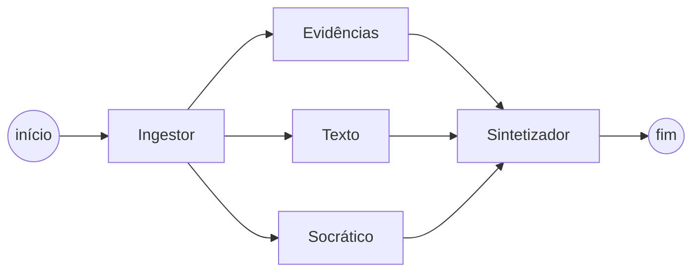
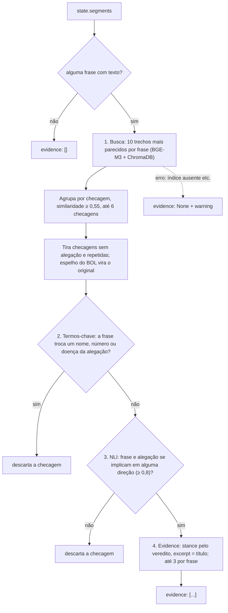

# Agente de Evidências

Dono: R2 (Túlio Celeri) · Branch: `AgenteEvidencias` · Atualizado em 04/10/2026
Decisões, alternativas e números: [`evidencias_decisoes.md`](evidencias_decisoes.md) (ADRs)

## Resumo

Para cada frase da notícia, o agente procura **checagens já publicadas por agências sobre a mesma alegação** e devolve o que a agência concluiu, com o título da checagem e o link. Ele não usa LLM: busca por embeddings num índice ChromaDB, confere se a checagem trata da mesma alegação (termos-chave + NLI) e tira a stance do veredito da agência.

Estado em 04/10/2026: pronto para o PR. No conjunto de avaliação (42 frases), Recall@5 0,96, macro-F1 de stance 0,77, nenhuma evidência inventada e stance certa em todas as 19 frases em que citou a checagem certa. A única meta não atingida é a de casamento errado: 4, com meta 0 (ver [Limitações conhecidas](#limitações-conhecidas)).

## Sumário

- [Onde o agente fica no sistema](#onde-o-agente-fica-no-sistema)
- [Contrato (entrada e saída)](#contrato-entrada-e-saída)
- [Fluxo, passo a passo](#fluxo-passo-a-passo)
- [Exemplo completo](#exemplo-completo)
- [Corpus e índice](#corpus-e-índice)
- [Arquivos](#arquivos)
- [Como rodar](#como-rodar)
- [Configuração](#configuração)
- [Desempenho](#desempenho)
- [Avaliação](#avaliação)
- [Limitações conhecidas](#limitações-conhecidas)
- [Integração com os outros agentes](#integração-com-os-outros-agentes)
- [Testes](#testes)
- [Solução de problemas](#solução-de-problemas)
- [Glossário](#glossário)
- [Fontes e licenças](#fontes-e-licenças)

## Onde o agente fica no sistema



- **Lê** só `state.segments`, a lista de frases (`Segment`: `id` e `text`) que o Ingestor produz.
- **Escreve** `state.evidence` e, se falhar, uma mensagem em `state.warnings`. Não lê nem escreve nenhum outro campo.
- Roda **em paralelo** com os agentes Texto e Socrático. O Sintetizador junta os três ramos no dossiê.
- **Sem LLM**, de propósito: o resultado é reproduzível, roda localmente e não inventa texto. Tudo o que o agente devolve foi escrito pela agência (título e veredito) ou é um rótulo fixo (stance).

## Contrato (entrada e saída)

`run(state) -> dict`, em `src/agents/evidence.py`. Os tipos `Segment` e `Evidence` vêm do `src/state.py` (Seção 3.3 do Manual).

```python
run(state) -> {"evidence": [
    {"segment_id": "s01",
     "stance": "contradiz",
     "excerpt": "É falso que segurança do Carrefour acusado de matar cachorro foi agredido em Osasco",
     "source_url": "https://www.agencialupa.org/jornalismo/2018/12/07/verificamos-seguranca-carrefour-agredido-osasco/",
     "source_name": "Agência Lupa (2018)",
     "agency_verdict": "Falso"}]}
```

| Campo | O que é | De onde vem |
| --- | --- | --- |
| `segment_id` | A frase da notícia a que a evidência se refere | `Segment.id` |
| `stance` | `contradiz`, `apoia` ou `insuficiente` | Do veredito da agência (tabela no passo 4) |
| `excerpt` | Trecho **literal** da checagem: o título, que é a conclusão escrita pela agência | `review_title`, cortado em até 300 caracteres no fim de uma frase |
| `source_url` | Link da checagem | URL da checagem no índice (o original, nunca o espelho do BOL) |
| `source_name` | Agência | Como a fonte publica ("Aos Fatos", "AFP Checamos"); checagens do FACTCK.BR levam o ano ("Agência Lupa (2019)") |
| `agency_verdict` | Veredito como a agência publicou, para citar com atribuição | Rótulo da agência ("Falso", "Enganoso", "Não é bem assim"); `None` se a checagem não tem rótulo |

Regras da saída:

| Situação | Saída |
| --- | --- |
| Busca feita | `{"evidence": [...]}`; a lista pode ser vazia |
| Nenhuma frase com texto | `{"evidence": []}`, sem buscar |
| Frase sem checagem da mesma alegação | Nenhum objeto para ela (não existe evidência "vazia") |
| Várias checagens da mesma alegação | Até 3 por frase, da mais para a menos parecida com a frase |
| O agente falhou (índice ausente, modelo que não carrega, erro inesperado) | `{"evidence": None, "warnings": ["evidencias: <Erro>: <mensagem>"]}`: degradação graciosa (Seção 3.4); os outros ramos seguem |

`evidence: []` e `evidence: None` são coisas diferentes: a lista vazia diz "procurei e não há checagem"; `None` diz "não consegui procurar". Por isso índice ausente é falha, e não lista vazia.

## Fluxo, passo a passo



A ideia central (ADR 1): a stance **não** vem de comparar a frase com um trecho da checagem, como na Seção 4.2 do Manual, porque o trecho muitas vezes reproduz o próprio boato e o NLI diria `apoia`. A stance vem do **veredito da agência**, e o trabalho do agente é garantir que a checagem é sobre a **mesma alegação** da frase. Os passos 2 e 3 existem para isso.

### Passo 0: preparação

- Cada item de `state.segments` vira um `Segment` (aceita objetos de qualquer versão do `state.py` e dicts).
- Frases vazias são ignoradas. Sem nenhuma frase, devolve `{"evidence": []}` sem carregar os modelos.

### Passo 1: busca

Função: `search` (`src/retrieval/indice.py`), depois `group_hits_by_url` e `_candidates` (`src/agents/evidence.py`).

1. **Embedding das frases.** Todas as frases da notícia vão num único lote para o BGE-M3 (`BAAI/bge-m3`, multilíngue, 568 milhões de parâmetros), o mesmo modelo usado na indexação. Os vetores são normalizados.
2. **Busca no ChromaDB.** Para cada frase, os **10 trechos** mais parecidos (`EVIDENCE_SEARCH_K`), por distância de cosseno. A similaridade é `1 − distância`.
3. **Agrupamento por checagem.** Os trechos são agrupados pela URL da checagem. Ficam só os trechos com similaridade **≥ 0,55** (`EVIDENCE_SIM_THRESHOLD`) e com link. As checagens são ordenadas pelo melhor trecho, e ficam as **6 primeiras** (`EVIDENCE_CLAIM_CANDIDATES`).
4. **Limpeza das candidatas.**
   - Checagem sem `claim_reviewed` (a alegação checada) é descartada: sem ela, não dá para saber se é a mesma alegação. Hoje todas as checagens do corpus têm.
   - A mesma checagem publicada em dois endereços (mesmo título) conta uma vez. Se um dos endereços é um espelho (`bol.uol.com.br`, que republica o UOL Confere), fica o original, na mesma posição.

Por que 0,55, e não os 0,75 da Seção 5.3: medido no corpus real, outro assunto fica em ~0,45, outro fato do mesmo tema em ~0,55–0,57 e a checagem certa em ~0,58–0,68. Com 0,75, nada passaria. O limiar só separa "outro assunto"; "outro fato" é papel dos passos 2 e 3.

Por que 6 candidatas e não 3: com um limite de 3 antes do passo 2, o Aos Fatos ficava de fora no caso Fachin.

### Passo 2: termos-chave

Função: `key_terms_present` (`src/retrieval/etapa2.py`).

O NLI não percebe troca de nome entre frases quase iguais: "chá cura a dengue" × "chá cura a chikungunya" dá entailment 0,98. Este passo pega essas trocas antes do NLI.

1. **Termos-chave da frase**, em três classes:
   - **nomes próprios**: palavras com maiúscula, agrupadas ("Alexandre de Moraes" é um nome só; "de", "da", "do" ligam as partes);
   - **números**: normalizados ("1.800" vira 1800; "5 mil", 5000; "covid-19" não conta como número);
   - **doenças**: lista fixa (dengue, zika, chikungunya, covid, sarampo…), que funcionam como nomes mesmo em minúscula.
2. **Termos ausentes.** Um termo da frase é "ausente" se não aparece em nenhum texto da checagem (alegação, título e todos os trechos do texto). A comparação usa o prefixo de 5 letras, sem acentos, para tolerar variações ("Paraguai"/"paraguaio", "vacina"/"vacinou").
3. **Troca = ausente + substituto da mesma classe.** A checagem só é descartada se, além do termo ausente, a alegação tiver um termo **da mesma classe** que a frase não tem: é a assinatura de uma troca.

Exemplos, no padrão dos pares do experimento da etapa 2:

| Frase | Alegação checada | Resultado |
| --- | --- | --- |
| "Chá de mamão cura a chikungunya" | "Chá de folha de mamão cura dengue" | Descarta: chikungunya ausente, dengue sobrando |
| "Fux votou para soltar o réu" | "Lewandowski votou para soltar o réu" | Descarta: Fux ausente, Lewandowski sobrando |
| "Governo vai taxar Pix acima de R$ 50 mil" | "Governo vai taxar Pix acima de R$ 5 mil" | Descarta: 50000 ausente, 5000 sobrando |
| "No STF, Fachin apontou o dedo para Moraes" | "Foto mostra Fachin apontando o dedo para Moraes" | Segue: "STF" ausente, mas sem substituto (é só contexto) |

Dois cuidados com nomes:

- **A primeira palavra da frase** tem maiúscula por ser a primeira. Ela só conta como nome se não for uma palavra comum de início ("Governo", "Vídeo", "Presidente"…) e se o corpus a usa como nome. O vocabulário do corpus está em `data/corpus/nomes_proprios.txt`: palavras que aparecem com maiúscula no meio de alegações e títulos mais vezes do que em minúscula. Siglas curtas contam ("STF", "EUA", "COP30"); palavras longas em caixa alta não ("URGENTE"). Assim, "Lula disse…" tem um nome, e "Aviões de caça…" não.
- **Pontuação separa nomes** ("Arrependida, Cármen Lúcia…" não junta as palavras num nome só), e um nome colado a número fica inteiro ("COP30").

**Ancoragem lexical (G2).** Depois dos termos-chave, a candidata ainda precisa dividir pelo menos uma palavra de conteúdo com a alegação checada (sem "Foto mostra") ou com o título (`content_overlap` em `etapa2.py`, mesmo prefixo de 5 letras, sem acentos e sem stopwords); senão é de outro assunto e cai antes do NLI. O texto inteiro da checagem não entra, porque fala de muita coisa. Motivo e números no ADR 4.

### Passo 3: NLI

Funções: `normalize_claim` (`etapa2.py`), `classify` (`src/retrieval/nli.py`) e `claim_match_score` (`evidence.py`).

1. **Normalização da alegação.** Tira do início da alegação expressões como "Foto mostra", "Vídeo publicado no TikTok mostra que", "Em vídeo,". Para o NLI, "uma foto mostra X" não implica "X". No caso real UOL/Fachin, o entailment foi de 0,09 para 0,99 com a normalização.
2. **Duas direções.** Para cada candidata que passou no passo 2, o NLI (`MoritzLaurer/mDeBERTa-v3-base-mnli-xnli`) compara alegação → frase e frase → alegação. Basta **uma** direção, porque a notícia costuma ser mais específica ou mais genérica que a alegação checada.
3. **Um lote por notícia.** Todos os pares de todas as frases vão num único lote, para não carregar o modelo várias vezes.
4. **Limiar.** A checagem segue se o maior entailment for **≥ 0,8** (`EVIDENCE_CLAIM_MATCH_MIN_PROB`). O valor foi calibrado em 01/10 no split de calibração e medido uma vez no teste: com 0,8, a cobertura não caiu e os casamentos errados caíram (ADR, "Decisões menores").

O passo 2 e o passo 3 se completam: o NLI deixa passar troca de nome entre frases quase iguais, e os termos-chave pegam; os termos-chave deixam passar negação (a frase nega o que a alegação afirma, com os mesmos nomes), e o NLI pega. Nos 37 pares do experimento da etapa 2, a combinação acertou 35, com 0 casamentos errados.

### Passo 4: evidência

Funções: `_build_evidence`, `make_excerpt` (`evidence.py`), `stance_from_verdict`, `display_verdict` (`etapa2.py`).

**Stance pelo veredito.** O mapeamento é conservador: só rótulos inequívocos viram `contradiz` ou `apoia`.

| Rótulo da agência (sem acento, minúsculo) | Stance |
| --- | --- |
| falso, falsa, fake, montagem, mentira, mentiroso, é falso, inventado, fabricado | `contradiz` |
| verdadeiro, verdadeira, verdade, é verdade, comprovado, correto | `apoia` |
| qualquer outro: enganoso, distorcido, falta contexto, não é bem assim, contextualizando, sátira, texto livre, rótulo vazio | `insuficiente` |

No formato do Comprova ("Falso: Na verdade, o vídeo…"), vale só o rótulo antes dos dois-pontos, quando ele tem até 40 caracteres. Para conferir como cada rótulo do corpus é classificado: `python data/corpus/diagnostico.py --vereditos`.

**Veredito exibido** (`agency_verdict`): o rótulo como a agência publicou, sem sublinhados ("não_é_bem_assim" vira "Não é bem assim"), sem a explicação depois dos dois-pontos e com a primeira letra em maiúscula.

**Excerpt.** O título da checagem, que é a conclusão escrita pela agência e existe para todas as checagens, inclusive as que só têm título no índice. Se não houver título, usa o parágrafo de abertura; se não houver, o trecho encontrado. Acima de 300 caracteres, é cortado no fim de uma frase (ou num espaço), e o texto nunca é reescrito.

**Limite e ordem.** No máximo 3 evidências por frase (`EVIDENCE_MAX_PER_SEGMENT`). A ordem segue as frases da notícia e, dentro de cada frase, a similaridade da busca.

## Exemplo completo

Frase ev13/s01 do conjunto de avaliação, escrita a partir de uma checagem do FACTCK.BR (rodada de 03/10, `eval/resultados/evidencias_2026-10-03_4.json`):

> Um grupo de pessoas espancou em Osasco o segurança do Carrefour responsável pela morte do cachorro.

1. **Busca.** As 5 checagens mais próximas, na ordem:
   1. Agência Lupa (2018): "É falso que segurança do Carrefour acusado de matar cachorro foi agredido em Osasco";
   2. Estadão: homem que soltou um pitbull num shopping em protesto contra o preço do café;
   3. Estadão: vídeo gravado por adolescente suspeito no caso do cachorro Orelha;
   4. Agência Lupa (2019): policial esfaqueada;
   5. Aos Fatos: o mesmo caso do pitbull no shopping.

   As que passam do limiar de 0,55 (até 6) seguem como candidatas.
2. **Termos-chave.** A frase tem dois nomes, "Osasco" e "Carrefour" ("Um", no início, não conta), e nenhum número ou doença. Na checagem da Lupa, os dois aparecem: passa. Nas outras, eles não aparecem; a checagem só é descartada aqui se a alegação dela tiver outro nome no lugar, e as demais seguem para o NLI.
3. **NLI.** A alegação da Lupa, "Segurança que matou cachorro no Carrefour é espancado por populares em Osasco", e a frase dizem a mesma coisa: entailment acima de 0,8. Nenhuma outra candidata passou nos passos 2 e 3; o agente devolveu só a da Lupa.
4. **Evidência.** O veredito "Falso" vira `contradiz`; o excerpt é o título da Lupa; o `source_name` leva o ano ("Agência Lupa (2018)"). É exatamente o objeto do exemplo do [Contrato](#contrato-entrada-e-saída).

Para ver os números de cada passo (similaridade, termos ausentes, entailment nas duas direções) de qualquer frase:

```bash
python data/corpus/diagnostico.py --frases "Um grupo de pessoas espancou em Osasco o segurança do Carrefour responsável pela morte do cachorro."
```

## Corpus e índice

### Fontes

| Fonte | Checagens | Período | Observação |
| --- | --- | --- | --- |
| Google Fact Check Tools API | 15.423: Aos Fatos 3.960, UOL 3.778 (mais 487 espelhos do BOL), AFP Checamos 3.359, Estadão 2.618, Comprova 1.220 | 2015–2026 (sem limite de idade desde 07/10; antes, últimos 24 meses) | Coletadas em 84 buscas por site (83 palavras-chave e uma sem palavra-chave), porque a API dá erro 503 depois de ~500–600 resultados de uma mesma busca |
| FACTCK.BR (dataset acadêmico) | 727: Agência Lupa 379, Aos Fatos 348 | 2018–2019 | Só páginas com uma alegação; sem o Truco; sem as 4 checagens "verdadeiro" com título que desmente (ADR 2) |

A Lupa não aparece na API (testado com dois domínios), e por isso só entra pelo FACTCK.BR. A AFP e o UOL recusam o download do texto (bloqueio confirmado em 01/10, não contornado): as checagens deles entram no índice só pelo título e pela alegação.

### Do dado bruto ao índice

```text
collect_factcheck_api.py ─► raw/factcheck_api.jsonl   (alegação, título, veredito, agência, data, URL)
fetch_articles.py        ─► raw/articles.jsonl        (texto completo, quando o site permite)
import_factckbr.py       ─► raw/factckbr_claims.jsonl + raw/factckbr_articles.jsonl
build_index.py           ─► chroma_data/              (coleção checagens__baai-bge-m3)
                         ─► data/corpus/nomes_proprios.txt
```

Todos os scripts ficam em `data/corpus/`, rodam a partir da raiz do repositório e podem ser retomados. Os dados brutos (`data/corpus/raw/`) e o índice (`chroma_data/`) ficam fora do Git e estão no Google Drive (ver [Como rodar](#como-rodar)).

### Como uma checagem vira trechos

- **Trecho de título** (`chunk_kind` "titulo", `chunk_index` −1): toda checagem com título ganha um, mesmo sem texto baixado. É assim que as checagens da AFP entram no índice.
- **Trechos de texto** (`chunk_kind` "texto", `chunk_index` 0, 1, 2…): o texto completo é dividido em parágrafos (os com menos de 40 caracteres, como menus e legendas, saem), e os parágrafos são agrupados até 800 caracteres, repetindo 1 parágrafo entre um trecho e o seguinte.
- **Metadados de cada trecho:** `source_url`, `source_name`, `agency_verdict`, `review_date`, `claim_reviewed`, `review_title`, `corpus` ("factcheck_api" ou "factckbr"), `chunk_index`, `chunk_kind`.
- **IDs determinísticos** (hash da URL + número do trecho): rodar de novo atualiza em vez de duplicar, e o `--apenas-novos` calcula embeddings só do que falta.

Índice atual (07/10/2026): 15.938 checagens (8.314 com texto, 7.624 só com título), **99.464 trechos**. Antes da coleta sem limite de idade (03/10): 6.553 checagens e 36.071 trechos.

Checagens da API publicadas antes de 2024 levam o ano no `source_name` ("Aos Fatos (2019)"), como as do FACTCK.BR. Checagens sem data na API (5.282, a maioria do Estadão) ficam sem o ano.

### Coleção por modelo

O nome da coleção vem do modelo de embedding (`checagens__baai-bge-m3`). Trocar `EVIDENCE_EMBEDDING_MODEL` cria outra coleção, sem misturar índices; foi assim que o BGE-M3 foi comparado com o e5-large. O ChromaDB guarda os textos e metadados em `chroma.sqlite3` e o índice vetorial de cada coleção numa pasta com nome de código (UUID).

### Vocabulário de nomes

`data/corpus/nomes_proprios.txt` (versionado no Git) é gerado pelo `build_index.py` a partir das alegações e títulos. Regenere sempre que o corpus mudar: `python data/corpus/build_index.py --so-nomes` (só o vocabulário, sem recalcular o índice).

## Arquivos

| Arquivo | O que tem |
| --- | --- |
| `src/agents/evidence.py` | O agente: os passos 0 a 4 e `run(state)` |
| `src/retrieval/config.py` | Limiares, modelos, caminhos e constantes (variáveis de ambiente) |
| `src/retrieval/indice.py` | ChromaDB e embeddings: coleção, busca, trechos de uma checagem |
| `src/retrieval/etapa2.py` | "Mesma alegação": normalização da alegação, termos-chave, vocabulário de nomes, veredito → stance |
| `src/retrieval/nli.py` | Modelo de NLI (mDeBERTa) |
| `src/stubs/evidence_stub.py` | Stub para os outros agentes testarem sem modelos: devolve a fixture `02_evidencias_saida.json` (Seção 4.6) |
| `data/corpus/collect_factcheck_api.py` | Coleta pela Fact Check Tools API (precisa de `FACTCHECK_API_KEY`) |
| `data/corpus/fetch_articles.py` | Download do texto completo de cada checagem (desiste do site depois de 20 falhas seguidas) |
| `data/corpus/import_factckbr.py` | Converte o FACTCK.BR enriquecido para o formato do corpus |
| `data/corpus/build_index.py` | Trechos, embeddings e índice; gera o `nomes_proprios.txt` |
| `data/corpus/diagnostico.py` | Mostra cada passo do agente para uma frase; lista os vereditos do corpus |
| `data/corpus/experimento_etapa2.py` + `pares_etapa2.json` | Experimento da etapa 2 nos 37 pares (ADR 1) |
| `data/corpus/nomes_proprios.txt` | Palavras que o corpus usa como nome próprio |
| `data/gold/evidencias.json` | Conjunto de avaliação (parte de evidências do gold set) |
| `eval/avaliar_evidencias.py` | Avaliação: `sortear`, `esqueleto`, `completar`, `validar`, `avaliar`, `frases`, `calibrar` |
| `eval/medir_recursos.py` | Tempo de carga, memória dos modelos (orçamento da Seção 5.2) e tempo por notícia |
| `eval/resultados/` | Resultado de cada rodada salva, versionado para o relatório |
| `tests/` | Unitários (sem modelos), contrato e integração (modelos reais); ver [Testes](#testes) |
| `docs/agents/evidencias_decisoes.md` | ADRs: decisões, alternativas, números, pendências e histórico |

## Como rodar

Sempre a partir da raiz do repositório, com o ambiente virtual ativado. Os comandos `python` são iguais nos dois sistemas; muda só a ativação do ambiente e a forma de definir variáveis de ambiente.

### Índice e dados prontos (sem refazer o corpus)

Para rodar o agente, não é preciso coletar o corpus nem indexar. A pasta do Google Drive (https://drive.google.com/drive/folders/1FrQBt0Q34wez1ZnvsIkLEvClwSNjQuGQ?usp=sharing) tem dois arquivos:

| Arquivo | Pasta criada ao extrair | Para quê |
| --- | --- | --- |
| `chroma_data.zip` | `chroma_data/` | Índice que o agente consulta: coleção `checagens__baai-bge-m3` (BGE-M3), com 99.464 trechos (API 2015–2026 + FACTCK.BR), gerada em 07/10/2026 com `chromadb` 1.5.9. Basta ele para rodar o agente. |
| `raw.zip` | `data/corpus/raw/` | Dados brutos: checagens da API, textos baixados e FACTCK.BR (CSV e arquivos convertidos). Necessário para a avaliação (`sortear`, `validar` e `avaliar` leem o corpus daqui) e para refazer o índice sem a chave da API. |

- O `requirements.txt` fixa o `chromadb` em 1.5.9: um índice criado numa versão pode não abrir em outra.
- Se já existir uma pasta `chroma_data/`, apague-a antes de extrair; misturar índices deixa coleções órfãs.
- Os dois arquivos são só para o grupo: trazem o texto integral das checagens das agências, que não é nosso para redistribuir (por isso também ficam fora do Git). Não publique o link.

```powershell
# Windows: baixe os dois zips para a raiz do repositório e extraia
Expand-Archive chroma_data.zip -DestinationPath .            # cria ./chroma_data
Expand-Archive raw.zip -DestinationPath data/corpus          # cria data/corpus/raw
python data/corpus/diagnostico.py --frases "Fachin apontou o dedo para Moraes no STF."   # confere o índice
```

```bash
# macOS
unzip chroma_data.zip -d .
unzip raw.zip -d data/corpus
python data/corpus/diagnostico.py --frases "Fachin apontou o dedo para Moraes no STF."
```

Cada zip já traz a própria pasta (`chroma_data/` e `raw/`), por isso a extração é na pasta de cima. Depois de extrair, `chroma_data/` deve ter o `chroma.sqlite3` e uma pasta com nome de código (o índice vetorial da coleção), e `data/corpus/raw/` deve ter o `factcheck_api.jsonl`, o `articles.jsonl` e os arquivos `factckbr_*`, sem uma pasta a mais no meio. Os modelos (BGE-M3 e mDeBERTa) são baixados do Hugging Face na primeira execução. Para usar o índice em outra pasta, defina `EVIDENCE_CHROMA_PATH`. Os comandos de corpus abaixo só servem para refazer o índice.

### Usar o agente direto do Python

```python
from types import SimpleNamespace
from src.agents.evidence import run

estado = SimpleNamespace(segments=[{"id": "s01", "text": "Fachin apontou o dedo para Moraes no STF."}])
print(run(estado))      # no grafo, o estado é o PipelineState montado a partir do Ingestor
```

O `run` só usa o atributo `segments`, então qualquer objeto com ele serve.

### Comandos

**Windows (PowerShell)**

```powershell
venv\Scripts\Activate.ps1                                # ativa o ambiente virtual

python -m pytest tests                                   # testes rápidos, sem modelos

$env:FACTCHECK_API_KEY = "sua-chave"                     # corpus (retomável)
python data/corpus/collect_factcheck_api.py
python data/corpus/fetch_articles.py
python data/corpus/build_index.py --reset

python data/corpus/import_factckbr.py                   # FACTCK.BR (o CSV fica em data/corpus/raw/)
python data/corpus/build_index.py --apenas-novos        # só os trechos que faltam no índice

python data/corpus/diagnostico.py --frases "Fachin apontou o dedo para Moraes no STF."
python data/corpus/experimento_etapa2.py                 # etapa 2 nos 37 pares (NLI real)

$env:EVIDENCE_INTEGRATION = "1"                          # testes com os modelos reais
python -m pytest tests/integration -v -s
```

**macOS (Terminal, zsh)**

```bash
source venv/bin/activate                                 # ativa o ambiente virtual

python -m pytest tests                                   # testes rápidos, sem modelos

export FACTCHECK_API_KEY="sua-chave"                     # corpus (retomável)
python data/corpus/collect_factcheck_api.py
python data/corpus/fetch_articles.py
python data/corpus/build_index.py --reset

python data/corpus/import_factckbr.py                   # FACTCK.BR (o CSV fica em data/corpus/raw/)
python data/corpus/build_index.py --apenas-novos        # só os trechos que faltam no índice

python data/corpus/diagnostico.py --frases "Fachin apontou o dedo para Moraes no STF."
python data/corpus/experimento_etapa2.py                 # etapa 2 nos 37 pares (NLI real)

export EVIDENCE_INTEGRATION=1                            # testes com os modelos reais
python -m pytest tests/integration -v -s
```

**Avaliação** (os comandos são iguais nos dois sistemas)

```bash
python eval/avaliar_evidencias.py sortear --n 30                        # checagens para parafrasear
python eval/avaliar_evidencias.py sortear --n 10 --veredito verdadeiro
python eval/avaliar_evidencias.py sortear --n 5 --agencia AFP
python eval/avaliar_evidencias.py esqueleto                             # 12 entradas com as checagens e as frases em branco
python eval/avaliar_evidencias.py completar                             # monta o texto das entradas a partir das frases
python eval/avaliar_evidencias.py validar                               # confere data/gold/evidencias.json
python eval/avaliar_evidencias.py avaliar --split todos --salvar        # índice e modelos reais
python eval/avaliar_evidencias.py calibrar --nli 0.5 0.6 0.7 0.8       # limiares, só no split de calibração
python eval/avaliar_evidencias.py frases                                # entrada do diagnostico.py --arquivo
python eval/medir_recursos.py --comparar-fp16 --salvar                  # tempo e memória
```

A variável vale só para a janela do terminal em que foi definida. Fora do ambiente virtual, no macOS, use `python3` no lugar de `python`. No Mac com Apple Silicon, o agente usa a GPU (`mps`) automaticamente.

## Configuração

Ajustáveis por variável de ambiente (`src/retrieval/config.py`):

| Variável | Padrão | Uso |
| --- | --- | --- |
| `EVIDENCE_SIM_THRESHOLD` | `0.55` | Similaridade mínima na busca (passo 1) |
| `EVIDENCE_CLAIM_MATCH_MIN_PROB` | `0.8` | Entailment mínimo do NLI (passo 3); calibrado em 01/10, `0.5` volta ao valor antigo |
| `EVIDENCE_MIN_CONTENT_OVERLAP` | `1` | Palavras de conteúdo que a frase divide com a alegação checada ou o título (passo 2, ancoragem lexical); `0` desliga |
| `EVIDENCE_SEARCH_K` / `EVIDENCE_CLAIM_CANDIDATES` / `EVIDENCE_MAX_PER_SEGMENT` | `10` / `6` / `3` | Trechos buscados por frase / checagens avaliadas / evidências por frase |
| `EVIDENCE_EMBEDDING_MODEL` / `EVIDENCE_NLI_MODEL` | `BAAI/bge-m3` / `MoritzLaurer/mDeBERTa-v3-base-mnli-xnli` | Modelos |
| `EVIDENCE_DEVICE` | automático | `cuda` → `mps` → `cpu`; `cpu` força a CPU (as avaliações oficiais rodam assim) |
| `EVIDENCE_NLI_FP16` | `0` | `1` pede o NLI em fp16 na GPU. Medido em 03/10: não muda nada, porque o modelo já carrega em meia precisão |
| `EVIDENCE_CHROMA_PATH` / `EVIDENCE_RAW_DIR` | `chroma_data/` / `data/corpus/raw/` | Caminhos (fora do Git) |

Constantes fixas no código:

| Constante | Valor | Uso |
| --- | --- | --- |
| `CHUNK_MAX_CHARS` / `CHUNK_OVERLAP_PARAGRAPHS` / `MIN_PARAGRAPH_CHARS` | 800 / 1 / 40 | Divisão do texto em trechos |
| `EXCERPT_MAX_CHARS` | 300 | Tamanho máximo do excerpt |
| `BATCH_SIZE` | 16 | Lote dos modelos |
| `EMBEDDING_FP16` | ligado | BGE-M3 em fp16 na GPU (na CPU fica em fp32) |
| `COLLECTION_PREFIX` | `checagens` | Prefixo do nome da coleção |

## Desempenho

Medido com `eval/medir_recursos.py` no Windows (`eval/resultados/recursos_2026-10-01.json` e `recursos_2026-10-03.json`):

| | CPU | GPU NVIDIA |
| --- | --- | --- |
| Pesos (embeddings + NLI) | 2,12 + 0,52 = **2,63 GB** (acima do orçamento de 2 GB da Seção 5.2) | 1,06 + 0,52 = **1,58 GB** (dentro) |
| Carregar os modelos | ~13 s | ~14 s |
| Notícia de 3 frases (p50) | 4,9 s | 0,11 s |
| Notícia de 36 frases (p50) | 64 s | 0,79 s |

Na GPU, o pico alocado foi de 2,59 GB, porque soma as ativações dos lotes aos pesos. Falta a medida no Mac da demo (R1, Seção 9.3). No Mac, a rodada de 01/10 levou de 0,1 a 0,4 s por notícia de 3 frases.

## Avaliação

Mede as métricas da Seção 7.1 sem esperar o harness do R3. Definições e motivos no ADR 3 de [`evidencias_decisoes.md`](evidencias_decisoes.md).

### Conjunto: `data/gold/evidencias.json`

14 entradas e 42 frases, metade no split `calibracao` e metade no `teste`. Cada entrada é um texto curto de notícia; cada frase tem tipo, URLs aceitas e stance esperada. Quando o R3 definir o formato do gold set, um conversor leva os dados para lá.

```json
{"versao": 1, "entradas": [{
  "id": "ev01", "split": "teste", "anotador": "R2", "revisor": null,
  "texto": "Texto completo da notícia, como o Ingestor receberia.",
  "frases": [
    {"id": "s01", "texto": "Frase parafraseada que afirma o boato.", "tipo": "com_checagem",
     "checagens_aceitas": ["https://www.aosfatos.org/noticias/...", "https://checamos.afp.com/..."],
     "stance_esperada": "contradiz", "alegacao_original": "claim_reviewed de onde veio a paráfrase", "obs": ""},
    {"id": "s02", "texto": "Frase sobre um fato que não foi checado.", "tipo": "sem_checagem",
     "checagens_aceitas": [], "stance_esperada": null}]}]}
```

| Tipo | Frases hoje | `checagens_aceitas` | `stance_esperada` |
| --- | --- | --- | --- |
| `com_checagem` | 23 (15 `contradiz`, 4 `insuficiente`, 4 `apoia`) | Todas as URLs da mesma alegação (espelho UOL/BOL, outras agências) | Pelo veredito: falso → `contradiz`, verdadeiro → `apoia`, o resto → `insuficiente` |
| `sem_checagem` | 12 | vazia | `null` |
| `fato_parecido` / `troca_numero` | 3 / 2 | vazia (qualquer evidência é casamento errado) | `null` |
| `desmente` ("a foto é falsa") | 2 | a checagem do boato | `apoia` (a checagem apoia a frase) |

Origem das frases: as 36 de ev01 a ev12 foram escritas pelo Claude, a pedido do R2, em 01/10, o que contraria a regra 6 abaixo; as 6 de ev13 e ev14 (03/10) foram escritas pelo R2, a partir de checagens do FACTCK.BR. Antes de os números entrarem no relatório, o R1 revisa as frases (campo `revisor`) e o relatório declara a origem das paráfrases. O `validar` sai sem erros; os 3 avisos que restam são o veredito de ev11/s01 (decisão registrada no `obs` da frase), a falta de revisor e 15 frases `contradiz` para uma faixa de 10 a 14, pensada para 36 frases.

Regras de anotação:

1. **Parafrasear, nunca copiar** (Seção 6.2). Mantenha nomes, números e lugares; mude palavras e ordem.
2. **Não usar as checagens dos 37 pares** (`data/corpus/pares_etapa2.json`): as regras foram ajustadas neles. O `sortear` já as exclui.
3. **`sem_checagem`**: frases plausíveis e do mesmo universo de temas (saúde, política, STF). Confirme com `diagnostico.py --frases` que nada no corpus checa aquilo.
4. **`fato_parecido`**: uma checagem real com um termo trocado (doença, nome, número); preencha `alegacao_original`. O caso do mamão (Lupa) não serve: não há checagem de mamão/dengue no corpus.
5. **URLs aceitas**: rode `diagnostico.py --frases "<paráfrase>"` e inclua as checagens da mesma alegação. A decisão é de quem anota, não da similaridade.
6. **Quem anota**: uma pessoa; as paráfrases não são geradas por LLM. Quem conhece as regras do agente deve escrever como alguém que nunca viu o código. O campo `revisor` é do revisor cruzado (R1).
7. **Split por entrada**: metade `calibracao`, metade `teste`. Os limiares são ajustados só na calibração.

O `validar` confere tudo isso que é verificável: JSON e ids, tipo × URLs × stance, URL existente no corpus, URL nos 37 pares, veredito × stance, frase presente no texto da entrada, vazamento (mais de 60% das palavras da frase no título ou na alegação), revisor, split e composição. Erros impedem o `avaliar`; avisos não.

### Como ampliar o conjunto

1. Escolha checagens com o `sortear` (`--veredito`, `--agencia` e `--semente` filtram e tornam a escolha reproduzível). Ele já descarta guias explicativos, alegações negativas, perguntas, links, textos longos, espelhos e as checagens dos 37 pares.
2. Acrescente a entrada no `evidencias.json` com as frases em branco: tipo, URLs aceitas (com os espelhos), `stance_esperada`, `alegacao_original` e, como apoio, `_veredito` e `_base` (a checagem de origem das trocas). Numa base nova, o `esqueleto` gera tudo isso para 12 entradas.
3. Escreva o `texto` de cada frase lendo só a `alegacao_original`, sem abrir o título.
4. Rode o `diagnostico.py` com as frases e acrescente em `checagens_aceitas` as outras URLs da mesma alegação; confirme que as `sem_checagem` não têm checagem.
5. Rode `completar` (monta o `texto` da entrada; `--refazer-textos` remonta as que já têm texto) e `validar`.

Os campos que começam com `_` são só de apoio: o `avaliar` e o `validar` os ignoram.

### Métricas

| Métrica | Frases | Definição | Meta |
| --- | --- | --- | --- |
| Recall@5 (busca) | `com_checagem` | Alguma URL aceita entre as 5 primeiras checagens distintas da busca (`search(k=30)` + `group_hits_by_url` sem limiar). Sem limiar e sem etapa 2: mede a recuperação. | ≥ 0,70 |
| Cobertura (agente) | `com_checagem` | O agente emitiu evidência com URL aceita. Mostra quanto o limiar e a etapa 2 cortam. | — |
| Macro-F1 de stance | `com_checagem`, `desmente` | Prevista = stance da primeira evidência com URL aceita; sem ela, `insuficiente` (Seção 4.8). Média nas classes com exemplo anotado. | ≥ 0,65 |
| Stance nas cobertas | `com_checagem`, `desmente` em que o agente citou uma URL aceita | % com a stance certa. Separa erro de stance de checagem perdida: no macro-F1, uma frase `insuficiente` cuja checagem o agente perdeu conta como acerto. | — |
| Evidência inventada | `sem_checagem` | % de frases com qualquer evidência | ≤ 0,10 |
| Casamento errado | todas | Evidências com URL fora das aceitas (inclui `fato_parecido`) | 0 |

O relatório mostra números absolutos ao lado de cada taxa, a matriz de confusão e cada erro com a frase. Com `--salvar`, grava `eval/resultados/evidencias_<data>.json` com métricas, detalhe por frase, tempos, configuração (modelos, limiares, coleção, trechos no índice, versão do `chromadb`) e o commit.

### Resultados

| Data | Split | Recall@5 | Cobertura | Macro-F1 | Stance nas cobertas | Inventada | Casamento errado | Arquivo |
| --- | --- | --- | --- | --- | --- | --- | --- | --- |
| 01/10 | todos | 18/19 = **0,95** | 14/19 = 0,74 | **0,61** | 14/14 = 1,00 | 0/11 = **0,00** | **7** | `eval/resultados/evidencias_2026-10-01.json` |
| 01/10 | teste | 10/10 | 7/10 | 0,44 | 7/7 | 0/5 | 3 | (mesmo arquivo) |
| 01/10 | calibração | 8/9 | 7/9 | 0,75 | 7/7 | 0/6 | 4 | (mesmo arquivo) |
| 01/10 (termos-chave) | todos | 18/19 | **15/19 = 0,79** | **0,72** ✅ | 15/15 | 0/11 | 7 | `evidencias_2026-10-01_2.json` |
| 01/10 (termos-chave) | teste | 10/10 | 8/10 | 0,69 | 8/8 | 0/5 | 3 | (mesmo arquivo) |
| 01/10 (termos-chave) | calibração | 8/9 | 7/9 | 0,75 | 7/7 | 0/6 | 4 | (mesmo arquivo) |
| 01/10 (NLI 0,8) | teste | 10/10 | 8/10 | 0,69 ✅ | 8/8 | 0/5 | **2** | `evidencias_2026-10-01_3.json` |
| 03/10 (FACTCK.BR) | todos | 18/19 | 15/19 | 0,72 | 15/15 | 0/11 | 4 | `evidencias_2026-10-03_2.json` |
| 03/10 (e5-large) | todos | 16/19 | 13/19 | 0,69 | 13/13 | 0/11 | **1** | `evidencias_2026-10-03_3.json` |
| **03/10 (42 frases, atual)** | todos | 22/23 = **0,96** | 19/23 = **0,83** | **0,77** ✅ | 19/19 | 0/12 | 4 | `evidencias_2026-10-03_4.json` |
| 03/10 (42 frases) | teste | 12/12 | 10/12 | — | 10/10 | — | 2 | (mesmo arquivo) |
| 03/10 (42 frases) | calibração | 10/11 | 9/11 | — | 9/9 | — | 2 | (mesmo arquivo) |
| 03/10 (e5-large, 42 frases) | todos | 17/23 = 0,74 | 14/23 = 0,61 | 0,56 ❌ | 14/14 | 0/12 | 1 | `evidencias_2026-10-03_5.json` |
| **07/10 (corpus 2015–2026, atual)** | todos | 22/23 = **0,96** | 19/23 = **0,83** | **0,77** ✅ | 19/19 | 0/12 | 5 | `evidencias_2026-10-07.json` |

Configuração: BGE-M3, mDeBERTa, `SIM_THRESHOLD` 0,55, índice com 32.094 trechos. Primeira rodada: `CLAIM_MATCH_MIN_PROB` 0,5, Mac (`mps`), commit `9eba0f7`; a "stance nas cobertas" foi criada depois dela e calculada a partir do detalhe por frase salvo no arquivo. Rodadas "termos-chave" e "NLI 0,8": Windows (CPU), commit `fc2cce2`, com a correção dos termos-chave; a primeira com NLI 0,5, a segunda com 0,8 (o valor calibrado, medido uma única vez no teste). Rodadas de 03/10: NLI 0,8, commit `ee88110` com alterações locais. As de 36 frases usam o índice com o FACTCK.BR antes do descarte (36.099 trechos); a do BGE-M3 rodou na CPU e a do e5-large na GPU. As de 42 frases de 03/10 usam o índice de 36.071 trechos, as duas na CPU; os splits não têm macro-F1 próprio no relatório. A de 07/10 usa o índice de 99.464 trechos e rodou na GPU (NVIDIA).

Leitura:
- **Quando o agente acha a checagem certa, a stance sai certa** (19/19 na rodada atual). O que derruba o macro-F1 são checagens perdidas e as 2 frases que desmentem o boato (limitação do ADR 1), não erro de stance.
- **Checagens perdidas na rodada atual (4 de 23):** Arkansas e Cármen Lúcia (a checagem certa estava na busca, mas foi recusada na etapa 2), Janja em Roma (paráfrase que o NLI não reconheceu: entailment 0,00 e 0,10) e "Lula e o socialismo" (as duas checagens certas só têm título no índice e nem entram no top 5; é o único erro de Recall@5).
- A revocação de `insuficiente` (1,00) está inflada: frase `insuficiente` cuja checagem o agente perdeu conta como acerto. A "stance nas cobertas" existe para isso.
- **Calibração do NLI** (`calibracao_2026-10-01.json`, só no split de calibração): a cobertura ficou em 7/9 com 0,5, 0,6, 0,7 e 0,8, e os casamentos errados caíram de 4 para 2 com 0,8. No teste, 0,8 manteve a cobertura (8/10) e tirou 1 dos 3 casamentos errados.
- **Corpus 2015–2026** (07/10): com quase o triplo de trechos, as métricas ficaram iguais às de 03/10; as checagens novas não tiraram as certas do top 5. O 5º casamento errado (ev12/s03, camiseta de Flávio Bolsonaro) é uma lacuna do gabarito: o agente citou também as checagens da AFP e do UOL de 2022 sobre a mesma montagem, que voltou a circular em 2026, com a mesma conclusão. Falta acrescentá-las às `checagens_aceitas` na revisão. O conjunto não tem frases sobre checagens de 2015–2023, então o ganho do corpus novo ainda não foi medido.
- **FACTCK.BR** (03/10): nas 36 frases antigas nada mudou, porque nenhuma usava checagens dele. Nas 6 de ev13 e ev14, tudo certo: as 4 checagens vieram em 1º lugar na busca e foram citadas com a stance certa (duas `apoia`), o fato parecido (Moro × Cunha) foi barrado e a frase sem checagem ficou sem evidência.
- **BGE-M3 × e5-large** (03/10): **fica o BGE-M3.** De igual para igual (42 frases, mesmo índice, CPU), o e5 acha 5 checagens a menos na busca (17 × 22), entre elas as 4 do FACTCK.BR, e fica com macro-F1 0,56, abaixo da meta. Ele cita só 1 checagem errada, contra 4 do BGE-M3, mas porque acha menos em geral.
- A análise dos erros e os próximos passos estão no ADR 3.

### Experimentos feitos

| Experimento | Data | Resultado | Arquivo em `eval/resultados/` |
| --- | --- | --- | --- |
| Correção dos termos-chave (vocabulário de nomes, pontuação, "COP30") | 01/10 | Cobertura 14 → 15/19; macro-F1 0,61 → 0,72 | `evidencias_2026-10-01_2.json` |
| Calibração do limiar do NLI | 01/10 | 0,8 (era 0,5): mesma cobertura, menos casamentos errados | `calibracao_2026-10-01.json`, `evidencias_2026-10-01_3.json` |
| Tempo e memória na CPU | 01/10 | 2,63 GB; 4,9 s por notícia de 3 frases | `recursos_2026-10-01.json` |
| UOL: bloqueio ou limite de taxa? | 01/10 | 5 de 5 falhas com 3 s de pausa: bloqueio, não contornado | — |
| FACTCK.BR no corpus | 03/10 | Sem piora nas 36 frases antigas; 4 de 4 checagens novas citadas | `evidencias_2026-10-03_2.json`, `_4.json` |
| Tempo e memória numa GPU NVIDIA; NLI fp32 × fp16 | 03/10 | 1,58 GB; 0,11 s por notícia de 3 frases; fp16 sem diferença | `recursos_2026-10-03.json` |
| BGE-M3 × e5-large | 03/10 | Fica o BGE-M3 | `evidencias_2026-10-03_3.json`, `_5.json` |

Para comparar outro modelo de embedding: defina `EVIDENCE_EMBEDDING_MODEL`, rode `build_index.py --reset` (cria outra coleção; 30–60 min na GPU, algumas horas na CPU) e depois `avaliar` com `EVIDENCE_DEVICE=cpu`. Compare o Recall@5, que não depende do limiar, e os casamentos errados, que dependem do que a busca entrega à etapa 2.

### Como reproduzir

macOS:

```bash
source venv/bin/activate
python eval/avaliar_evidencias.py validar
python eval/avaliar_evidencias.py frases          # grava eval/resultados/frases_gold.txt
python data/corpus/diagnostico.py --arquivo eval/resultados/frases_gold.txt > eval/resultados/diagnostico_gold.txt
python eval/avaliar_evidencias.py avaliar --salvar
```

Windows (PowerShell): os mesmos comandos, ativando o ambiente com `venv\Scripts\Activate.ps1`. Antes, rode `$env:PYTHONUTF8 = "1"`: sem isso, o Python grava a saída redirecionada na codificação do Windows e quebra nos caracteres "✓" e "…" do diagnóstico. Para gravar o diagnóstico em UTF-8, use `| Out-File -Encoding utf8 eval/resultados/diagnostico_gold.txt` no lugar do `>`. Para números comparáveis com os da tabela, rode o `avaliar` com `$env:EVIDENCE_DEVICE = "cpu"`.

## Limitações conhecidas

- Só acha o que está no corpus: 15.423 checagens da API (2015–2026) e 727 do FACTCK.BR (Lupa e Aos Fatos, 2018–2019). A Lupa só aparece em checagens antigas, e o Truco ainda não entrou. Checagens do FACTCK.BR saem com o ano no nome da agência ("Agência Lupa (2019)"), porque podem estar desatualizadas. Checagens da AFP e da maior parte do UOL entram só pelo título e pela alegação: os dois sites recusam o download (o UOL foi testado de novo em 01/10), e o bloqueio não é contornado.
- Memória: numa GPU NVIDIA, 1,58 GB de pesos, dentro do orçamento de 2 GB; na CPU, 2,63 GB (o BGE-M3 fica em fp32), acima dele. Falta a medida no Mac da demo (ver o ADR).
- **Casamento errado: 4 nas 42 frases do conjunto (meta 0).** Nos quatro, o NLI aceitou uma checagem de outro fato, com o mesmo personagem e o mesmo tema, e os termos-chave não tinham o que barrar:
  - Kamala ("urnas do Arkansas trocavam votos de Trump por Kamala" × "Kamala Harris forjou ligação com eleitores", NLI 0,98) e Bolsonaro ("envenenado na cela da Papudinha" × "Vídeo mostra Bolsonaro deixando UTI", 0,93): mesma pessoa, outro episódio. Nenhum limiar separa esses casos;
  - Silvio Almeida (apoio a Boulos em 2026 × "Guilherme Boulos recebe apoio de Silvio Almeida"): a alegação checada não traz o ano, então a troca de 2024 para 2026 não aparece;
  - Marçal ("3 horas e 20 minutos sem votos" × "Porcentagem de votos dos candidatos não acompanha a porcentagem de urnas apuradas"): outra alegação sobre a apuração, sem o número.

  No dossiê, isso aparece como uma checagem vizinha do assunto; o título citado (`excerpt`) mostra de que fato ela trata. Uma regra que compare o episódio, e não só os termos, fica para depois do PR.
- Frases que **desmentem** o boato ("a foto é falsa") ficam sem evidência. Se casassem com a alegação, a stance sairia invertida.
- Paráfrases muito diferentes da alegação podem ser perdidas (ex.: "com dedo em riste", NLI 0,07). O agente prefere perder a citar a checagem errada.
- `apoia` é raro: das 5.826 checagens da API, 36 viram `apoia`, e 21 delas são guias do Comprova ("Como funciona o golpe do SMS"), não alegações. Uma ("Não é Moraes no avião de Vorcaro", Comprovado) daria a stance invertida, porque o comprovado é que a imagem é real. O FACTCK.BR acrescenta 8.
- Termos-chave dependem de maiúsculas corretas. O limiar do NLI (0,8) foi calibrado num conjunto pequeno, ainda sem a revisão do R1: recalibrar quando ele for revisado.
- Um nome que nunca apareceu no corpus não conta como nome quando abre a frase ("Fulano disse…"): uma troca desse nome por outro só é barrada pelo NLI. Regenere o `nomes_proprios.txt` quando o corpus mudar (`build_index.py --so-nomes`).
- Checagens antigas não têm data no contrato: o `Evidence` não tem campo de data. Por isso o FACTCK.BR leva o ano no `source_name`; nas checagens da API, a data fica só no índice (`review_date`).

## Integração com os outros agentes

### Grafo (R1)

- O `graph.py` ainda usa o **stub** (`src/stubs/evidence_stub.py`, nome `evidence_node`), que devolve sempre as duas evidências do caso do mamão (Seção 4.6), lidas de `tests/fixtures/caso_mamao_dengue/02_evidencias_saida.json`.
- Para plugar o agente real: `from src.agents.evidence import run as evidencias_node`. O `evidence.py` também expõe o alias `evidencias_node = run`.
- Quem roda o grafo precisa do índice (`chroma_data/`) e dos modelos. Sem o índice, o agente devolve `evidence: None` com um aviso, e o resto do grafo segue.
- O `tests/unit/test_state.py`, que roda o grafo inteiro, vai precisar simular a busca e o NLI quando o agente real entrar, porque o CI não tem torch nem chromadb. Os falsos de `tests/evidence_fakes.py` servem para isso.

### Sintetizador (R5)

- Cada evidência é uma conclusão de **agência**, não do sistema. O dossiê deve atribuir ("Segundo a Agência Lupa (2018), é falso que…"), usar o `excerpt` entre aspas, sem reescrever, e dar o link (`source_url`).
- `stance` diz a relação da checagem com a frase: `contradiz` (a agência disse que é falso), `apoia` (disse que é verdadeiro), `insuficiente` (enganoso, fora de contexto, sem conclusão binária). `insuficiente` não é "não encontrei": frase sem checagem não tem evidência.
- `evidence: None` significa que o agente falhou; o dossiê deve dizer que as checagens não puderam ser consultadas, e não que não existem.
- O `agency_verdict` é o rótulo literal da agência; use-o com atribuição, sem traduzir para "verdadeiro/falso" do sistema.

### Interface (R4)

- Hoje a interface mostra só a `stance` e o `excerpt`. Faltam o link (`source_url`), a agência (`source_name`) e o veredito (`agency_verdict`), que são o que torna a evidência verificável pelo leitor.
- As evidências chegam como dicts (ou objetos `Evidence`, depois da validação do `PipelineState`) e `evidence` pode ser `None`.

### Fixtures e casos de borda

- `tests/fixtures/bordas/evidencias_*.json` seguem o formato do grupo, com uma chave a mais, `hits` (busca simulada para o teste unitário): checagem neutra, fato parecido (dengue × chikungunya), sem checagem e veredito inconclusivo.

## Testes

```bash
python -m pytest tests                                   # unitários e contrato, sem modelos (é o que o CI roda)
EVIDENCE_INTEGRATION=1 python -m pytest tests/integration -v -s   # modelos e índice reais
```

| Arquivo | Testes | O que cobre |
| --- | --- | --- |
| `tests/unit/test_evidence_agente.py` | 23 | Os 4 passos com busca e NLI simulados: limiar, agrupamento, 6 candidatas e 3 evidências, espelho, termos-chave antes do NLI, duas direções num lote, stance, excerpt, falha → aviso, casos de borda, caso do mamão |
| `tests/unit/test_evidence_etapa2.py` | 14 | Normalização da alegação e dos números, termos-chave, nomes compostos, vocabulário de nomes, mapeamento de vereditos |
| `tests/unit/test_evidence_corpus_scripts.py` | 16 | Trechos, título sem texto, download que desiste do site, `--apenas-novos`, importador do FACTCK.BR (filtros, títulos, descarte do "verdadeiro" trocado) |
| `tests/unit/test_evidence_avaliacao.py` | 46 | Métricas calculadas à mão, `validar`, `sortear`, `esqueleto`, `completar`, `calibrar`, conjunto versionado válido |
| `tests/unit/test_evidence_recursos.py` | 3 | Contas do `medir_recursos.py` (memória dos pesos, percentis, fp32 × fp16) |
| `tests/contract/test_evidence_contract.py` | 3 | Saída no schema da Seção 3.3, também dentro do `PipelineState` estrito; stub; falha |
| `tests/integration/test_evidence_integration.py` | 2 | Etapa 2 com o NLI real nos 37 pares (nenhum casamento errado) e o agente no índice real |

Os unitários usam `tests/evidence_fakes.py`, que simula a busca e o NLI. Por isso o CI não precisa de torch, chromadb nem do índice.

## Solução de problemas

| Sintoma | Causa e solução |
| --- | --- |
| `evidence: None` com um aviso "evidencias: ..." dizendo que a coleção não existe | Índice ausente ou em outra pasta. Baixe e extraia o `chroma_data.zip` ou defina `EVIDENCE_CHROMA_PATH`. Confira com o `diagnostico.py`. |
| Erro ao abrir o índice depois de atualizar pacotes | Versão do `chromadb` diferente da que criou o índice. Use a 1.5.9 (`pip install -r requirements.txt`). |
| Erro de codificação ("charmap", "UnicodeEncodeError") no Windows | Rode `$env:PYTHONUTF8 = "1"` antes dos scripts e use `Out-File -Encoding utf8` para gravar saídas redirecionadas. |
| O script parece travado no PowerShell | O console entrou no modo de seleção (um clique na janela). Aperte Enter ou Esc. |
| Tem GPU NVIDIA, mas o agente roda na CPU | O torch instalado é a versão `+cpu` (`python -c "import torch; print(torch.__version__, torch.cuda.is_available())"`). Reinstale o torch com CUDA pelo seletor de pytorch.org; placas mais novas podem exigir a versão mais recente do CUDA que o seletor oferece. |
| Números da avaliação diferentes dos da tabela | Rode com `EVIDENCE_DEVICE=cpu`: as rodadas oficiais são na CPU, e GPU e CPU podem diferir nas casas decimais do NLI. Confira também se o índice tem 99.464 trechos (36.071 nas rodadas até 03/10) (aparece no resultado salvo). |
| Busca ruim com o e5 | A família e5 exige os prefixos `query:` e `passage:`; o `indice.py` põe os dois automaticamente quando o nome do modelo tem "e5". Índices do e5 feitos sem prefixo precisam ser refeitos. |
| Nome próprio novo não barra uma troca | O vocabulário está desatualizado: `python data/corpus/build_index.py --so-nomes`. |
| Aviso "unauthenticated requests to the HF Hub" | Inofensivo: só diz que o download dos modelos não usa token do Hugging Face. |
| `chroma_data/` com várias pastas de nome de código | Sobras de coleções apagadas (no Windows, o Chroma nem sempre apaga a pasta). O agente só usa a coleção do modelo atual; para limpar, extraia de novo o índice do Drive numa pasta vazia. |

## Glossário

| Termo | Significado aqui |
| --- | --- |
| Checagem | Uma página de agência de checagem que avalia uma alegação (uma URL) |
| Alegação (`claim_reviewed`) | O que a agência checou, como ela resumiu ("Lula sancionou lei que permitiu bets") |
| Veredito (`agency_verdict`) | O rótulo que a agência deu ("Falso", "Enganoso") |
| Trecho | Pedaço indexado de uma checagem: o título ou até 800 caracteres do texto |
| Similaridade | Cosseno entre o embedding da frase e o do trecho (0 a 1) |
| Entailment | Probabilidade, segundo o NLI, de um texto implicar o outro |
| Mesma alegação | A checagem trata do mesmo fato da frase: passou nos termos-chave e no NLI |
| Stance | Relação da checagem com a frase: `contradiz`, `apoia` ou `insuficiente` |
| Espelho | Site que republica a checagem de outro com o mesmo título (BOL → UOL, Acervo → Estadão) |
| Casamento errado | Evidência que cita uma checagem de outra alegação: o erro mais grave (Seção 12.1) |
| Fato parecido | Frase igual a uma alegação checada, mas com um nome, número ou doença trocado: não deve receber a checagem |

## Fontes e licenças

- Google Fact Check Tools API (Aos Fatos, Comprova, AFP Checamos, Estadão Verifica, UOL Confere). Documentação: https://developers.google.com/fact-check/tools/api/reference/rest/v1alpha1/claims/search
- FACTCK.BR, https://github.com/jghm-f/FACTCK.BR (licença MIT). Os autores pedem a citação do artigo: WebMedia '19, https://doi.org/10.1145/3323503.3361698. Versão tratada e com texto completo: `factckbr_com_texto.csv` (R2), convertida pelo `import_factckbr.py`; regras no ADR 2.
- Modelos: `BAAI/bge-m3` e `MoritzLaurer/mDeBERTa-v3-base-mnli-xnli`, pelo Hugging Face.
- Os textos das checagens são das agências. Ficam fora do Git e são compartilhados só com o grupo.
